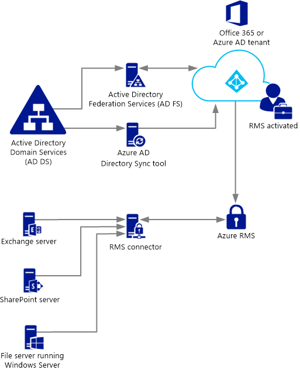

# Implementar o conector de gest&#227;o de direitos do Azure
Utilize estas informações para saber mais sobre o conector do Microsoft Rights Management (RMS) e como pode utilizá-lo para fornecer proteção de informações com as implementações no local existentes que utiliza o Microsoft Exchange Server, Microsoft SharePoint Server ou servidores de ficheiros que executam o Windows Server e utilizam a capacidade de infraestrutura de classificação de ficheiros (FCI) do Gestor de recursos do servidor de ficheiros.

> [!TIP]
> Para um cenário de exemplo de alto nível com capturas de ecrã, consulte o [Proteger automaticamente os ficheiros em servidores de ficheiros a executar o Windows Server e a infraestrutura de classificação de ficheiros](../Topic/What_is_Azure_Rights_Management_.md#BKMK_Example_FCI) secção a [O que é o Azure Rights Management?](../Topic/What_is_Azure_Rights_Management_.md) tópico.

## <a name="OverviewConnector"></a>Descrição geral do conector do Microsoft Rights Management
O conector do Microsoft Rights Management (RMS) permite-lhe ativar rapidamente servidores no local existentes utilizar a sua funcionalidade de gestão de direitos de informação (IRM) com o serviço da Microsoft Rights Management (RMS do Azure) baseado na nuvem. Com esta funcionalidade, IT e os utilizadores facilmente proteger documentos e imagens dentro da sua organização e de fora, sem ter de instalar outras infraestruturas ou estabelecer relações de fidedignidade com outras organizações. Pode utilizar este conector, mesmo se alguns dos seus utilizadores estão a ligar aos serviços online, num cenário híbrido. Por exemplo, caixas de correio de alguns dos utilizadores utilizam o Exchange Online e caixas de correio de alguns dos utilizadores utilizam o Exchange Server. Depois de instalar o conector de RMS, todos os utilizadores podem proteger e consumir mensagens de correio eletrónico e anexos, utilizando o Azure RMS e proteção de informações funciona na perfeição entre as configurações de implementação de dois.

O conector de RMS é um serviço de pequena-requisitos de espaço que instala no local, nos servidores que executem Windows Server 2012 R2, Windows Server 2012 ou Windows Server 2008 R2. Para além de que executa o conector em computadores físicos, pode também executá-lo em máquinas virtuais, incluindo VMs de IaaS do Azure. Depois de instalar e configurar o conector, é funciona como uma interface de comunicações (um reencaminhamento) entre os servidores no local e o serviço em nuvem.

Se gerir o seu próprio chave do inquilino para Azure RMS (traga é o proprietário chave ou cenário BYOK), o conector do RMS e os servidores no local que a utilizam não acedem o módulo de segurança de hardware (HSM) que contém a chave de inquilino. Isto acontece porque todas as operações de criptografia que utilizam a chave de inquilino são executadas no Azure RMS e não no local.



O conector de RMS suporta os seguintes servidores no local: Exchange Server, SharePoint Server e servidores de ficheiros que executam o Windows Server e utilizam a infraestrutura de classificação de ficheiros para classificar e aplicar políticas para documentos do Office numa pasta. Se pretender proteger todos os tipos de ficheiros utilizando a classificação de ficheiros, não utilize o conector de RMS, mas em vez disso, utilize o [proteção RMS cmdlets](https://msdn.microsoft.com/library/azure/mt433195.aspx).

> [!NOTE]
> Para versões suportadas destes servidores no local, consulte "servidores a no local que suportam o Azure RMS" no [Aplicações que suportem o Azure RMS](../Topic/Requirements_for_Azure_Rights_Management.md#BKMK_SupportedApplications) secção a [Requisitos para o Azure Rights Management](../Topic/Requirements_for_Azure_Rights_Management.md) tópico.

Utilize as secções seguintes para o ajudar a planear, instalar e configurar o conector do RMS. Em seguida, é necessário efetuar alguns configuração da instalação de mensagem para que os servidores podem utilizar o conector.

-   [Prerequisites for the RMS connector](../Topic/Deploying_the_Azure_Rights_Management_Connector.md#BKMK_Prereqs)

-   **Passo 1:**  [Installing the RMS connector](../Topic/Deploying_the_Azure_Rights_Management_Connector.md#BKMK_InstallingConnector)

-   **Passo 2:**  [Entering credentials](../Topic/Deploying_the_Azure_Rights_Management_Connector.md#EnteringCredentials)

-   **Passo 3:**  [Authorizing servers to use the RMS connector](../Topic/Deploying_the_Azure_Rights_Management_Connector.md#AuthorizingServers)

-   **Passo 4:**  [Configuring load balancing and high availability](../Topic/Deploying_the_Azure_Rights_Management_Connector.md#ConfiguringConnector)

-   Opcional: [Configuring the RMS connector to use HTTPS](../Topic/Deploying_the_Azure_Rights_Management_Connector.md#BKMK_ConfiguringHTTPS)

-   Opcional: [Configuring the RMS connector for a web proxy server](../Topic/Deploying_the_Azure_Rights_Management_Connector.md#BKMK_ConfiguringWebProxy)

-   Opcional: [Installing the RMS connector administration tool on administrative computers](../Topic/Deploying_the_Azure_Rights_Management_Connector.md#BKMK_InstallingStandaloneTool)

-   **Passo 5:**  [Configuring servers to use the RMS connector](../Topic/Deploying_the_Azure_Rights_Management_Connector.md#ConfiguringServers)

    -   [Configuring an Exchange server to use the connector](../Topic/Deploying_the_Azure_Rights_Management_Connector.md#BKMK_ExchangeServer)

    -   [Configuring a SharePoint server to use the connector](../Topic/Deploying_the_Azure_Rights_Management_Connector.md#BKMK_ConfiguringSharePoint)

    -   [Configuring a file server for File Classification Infrastructure to use the connector](../Topic/Deploying_the_Azure_Rights_Management_Connector.md#BKMK_FileServer)

-   [Next steps](../Topic/Deploying_the_Azure_Rights_Management_Connector.md#BKMK_NextSteps)

## <a name="BKMK_Prereqs"></a>Pré-requisitos para o conector do RMS
Antes de instalar o conector de RMS, certifique-se de que os seguintes requisitos são cumpridos.

|Requisito|Obter mais informações|
|-------------|--------------------------|
|O serviço de gestão de direitos (RMS) está ativado|[Ativar o Azure Rights Management](../Topic/Activating_Azure_Rights_Management.md)|
|Sincronização de diretórios entre as florestas do Active Directory e o Azure Active Directory|Depois do RMS está ativado, tem de configurar o Azure Active Directory para o seu trabalho com os utilizadores e grupos na base de dados do Active Directory. **Important:** É necessário efetuar este passo de sincronização de diretório para o conector do RMS para o seu trabalho, mesmo para uma rede de teste. Apesar de poder utilizar o Office 365 e o Azure Active Directory, utilizando as contas que criá-lo manualmente no Azure Active Directory, este conector requer que as contas no Azure Active Directory estão sincronizadas com serviços de domínio do Active Directory; sincronização de palavra-passe manual não é suficiente.<br />Para obter mais informações, consulte os seguintes recursos:<br /><br />-   [Instruções para configurar o seu inquilino do Azure AD](http://technet.microsoft.com/library/hh967611.aspx)<br />-   [Instruções para ativar a sincronização de diretórios com o AAD através do DirSync](http://technet.microsoft.com/library/hh967642.aspx)|
|Opcional mas recomendado:<br /><br />-   Ativar a Federação entre o Active Directory no local e o Azure Active Directory|Pode ativar a Federação de identidade entre o seu diretório no local e o Azure Active Directory. Esta configuração permite uma experiência de utilizador mais estável através da utilização de sessão único para o serviço de RMS. Sem início de sessão único, os utilizadores recebem um pedido para as respetivas credenciais antes de poderem utilizar conteúdo protegido por direitos.<br /><br />Para obter instruções configurar a Federação utilizando serviços de Federação do Active Directory (AD FS) entre o serviços de domínio do Active Directory e o Azure Active Directory, consulte o [lista de verificação: Utilizar o AD FS para implementar e gerir início de sessão único](http://technet.microsoft.com/library/jj205462.aspx) na biblioteca do Windows Server.|
|Um mínimo de dois computadores de membro em que pretende instalar o conector do RMS:<br /><br /><ul><li>Um versão de 64-bits computador físico ou virtual executar um dos seguintes sistemas operativos:<br /><br /><ul><li>Windows Server 2012 R2</li><li>Windows Server 2012</li><li>Windows Server 2008 R2</li></ul></li><li>Pelo menos 1 GB de RAM</li><li>Um mínimo de 64 GB de espaço em disco</li><li>Interface de rede, pelo menos, um</li><li>Acesso à Internet através de uma firewall (ou o web proxy) que não exija autenticação</li><li>Tem de estar numa floresta ou domínio que confie na noutras florestas na organização que contêm as instalações de servidores do Exchange ou do SharePoint que pretende utilizar com o conector do RMS</li></ul>|Para obter tolerância a falhas e de elevada disponibilidade, tem de instalar o conector do RMS no mínimo, dois computadores. **Tip:** Se estiver a utilizar o Outlook Web Access ou de dispositivos móveis que utilizam o Exchange ActiveSync IRM e é fundamental que manter o acesso a e-mails e anexos que estão protegidos pelo Azure RMS, recomendamos que irá implementar um grupo com balanceamento de carga dos servidores de conector para assegurar elevada disponibilidade.<br />Não necessita de servidores dedicados para executar o conector, mas terá de instalar num computador separado dos servidores que irá utilizar o conector. **Important:** Não instale o conector num computador que executa o Exchange Server, SharePoint Server ou um servidor de ficheiros que esteja configurado para a infraestrutura de classificação de ficheiros se pretender utilizar a funcionalidade destes serviços com o Azure RMS. Além disso, não instale este conector num controlador de domínio.|

## <a name="BKMK_InstallingConnector"></a>Instalar o conector do RMS
Depois de ter confirmado os pré-requisitos na secção anterior, utilize as seguintes instruções para instalar o conector do RMS:

1.  Identifique os computadores (mínimo de duas) que vai ser executado o conector do RMS. Estes têm de cumprir a especificação mínima listada na secção anterior.

    > [!NOTE]
    > Deverá instalar um único conector RMS (constituída por vários servidores para elevada disponibilidade) por inquilino (inquilino do Office 365 ou inquilino do Azure AD). Ao contrário do Active Directory RMS, não é necessário que instalar um conector do RMS em cada floresta.

2.  Transferir os ficheiros de origem para o conector de RMS a partir de [Microsoft Download Center](http://go.microsoft.com/fwlink/?LinkId=314106).

    Para instalar o conector de RMS, transferi RMSConnectorSetup.exe.

    Além disso:

    -   Se pretender mais tarde para configurar o conector de um computador de 32 bits, também transferi RMSConnectorAdminToolSetup_x86.exe.

    -   Se pretender utilizar a ferramenta de configuração de servidor para o conector de RMS, para automatizar a configuração das definições de registo em servidores no local, também transferi GenConnectorConfig.ps1.

3.  No computador no qual pretende instalar o conector de RMS, execute **RMSConnectorSetup.exe** com privilégios de administrador.

4.  Na página de boas-vindas da página Configuração de conector do Microsoft Rights Management, selecione **conector de instalar o Microsoft Rights Management no computador**, e, em seguida, clique em **seguinte**.

5.  Ler e aceitar os termos de licenciamento do RMS conector e, em seguida, clique em **seguinte**.

Para continuar, introduza uma conta e uma palavra-passe para configurar o conector do RMS.

## <a name="EnteringCredentials"></a>Introdução de credenciais
Antes de poder configurar o conector de RMS, tem de introduzir as credenciais de uma conta que possui privilégios suficientes para configurar o conector do RMS.

Além disso, se tiver implementado [integração controlos](https://technet.microsoft.com/library/jj658941.aspx), certifique-se de que a conta que especificar tem capacidade para proteger conteúdo. Por exemplo, se restringido a capacidade de proteger conteúdo para o grupo de "Departamento de TI", a conta que especificar aqui tem de ser um membro desse grupo. Caso contrário, verá a mensagem de erro: **A tentativa para detetar a localização do serviço de administração e organização falhou. Certifique-se de serviço do Microsoft Rights Management está ativado para a sua organização.**

Pode utilizar uma conta que tenha uma das seguintes privilégios:

-   **Administrador de inquilino do office 365**: Uma conta que seja um administrador global do seu inquilino do Office 365.

-   **Administrador global do azure Rights Management**: Uma conta com privilégios de administrador para o inquilino do Azure RMS.

-   **Conector do Microsoft RMS administrador**: Uma conta no Azure Active Directory tenham sido concedidas direitos para instalar e administrar o conector do RMS para a sua organização.

    > [!NOTE]
    > Se pretender utilizar o conector do Microsoft RMS conta de administrador, primeiro terá de efetuar o seguinte procedimento para atribuir a função de administrador do conector de RMS:
    > 
    > 1.  No mesmo computador, transfira e instale o Windows PowerShell para gestão de direitos. Para obter mais informações, consulte o artigo [Instalação do Windows PowerShell para o Azure Rights Management](../Topic/Installing_Windows_PowerShell_for_Azure_Rights_Management.md).
    > 
    >     Inicie o Windows PowerShell com o **Executar como administrador** comando e ligar ao serviço do Azure RMS utilizando o [Ligar AadrmService](https://msdn.microsoft.com/library/azure/dn629415.aspx) comando:
    > 
    >     ```
    >     Connect-AadrmService                   //provide Office 365 tenant administrator or Azure RMS global administrator credentials
    >     ```
    > 2.  Em seguida, execute o [Adicionar AadrmRoleBasedAdministrator](https://msdn.microsoft.com/library/azure/dn629417.aspx) comando, a utilizar apenas um dos seguintes parâmetros:
    > 
    >     ```
    >     Add-AadrmRoleBasedAdministrator -EmailAddress <email address> -Role "ConnectorAdministrator"
    >     ```
    > 
    >     ```
    >     Add-AadrmRoleBasedAdministrator -ObjectId <object id> -Role "ConnectorAdministrator"
    >     ```
    > 
    >     ```
    >     Add-AadrmRoleBasedAdministrator -SecurityGroupDisplayName <group Name> -Role "ConnectorAdministrator"
    >     ```
    >     Por exemplo, escreva: **Add-AadrmRoleBasedAdministrator -EmailAddress melisa@contoso.com -Role " ConnectorAdministrator "**
    > 
    >     Embora estes comandos utilizam a função ConnectorAdministrator, também pode usar a função GlobalAdministrator aqui, também.

Durante o processo de instalação do conector de RMS, são validado e instalado todos os pré-requisitos de software, serviços de informação Internet (IIS) está instalado se não estiver já presente e o software do conetor está instalado e configurado. Além disso, o Azure RMS está preparado para configuração através da criação da seguinte forma:

-   Uma tabela vazia de servidores que estejam autorizados a utilizar o conector para comunicar com o Azure RMS. Irá adicionar servidores para esta tabela mais tarde.

-   Um conjunto de tokens de segurança para o conector que autorizar operações com o Azure RMS. Estes tokens são transferidos a partir do Azure RMS e instalados no computador local no registo. Estes estão protegidos utilizando a dados protection application programming interface (DPAPI) e as credenciais da conta de sistema Local.

Na página final do assistente, efetue o seguinte procedimento e, em seguida, clique em **Concluir**:

-   Se esta for o primeira conector que tiver instalado, não selecione **Consola de administrador do conector de iniciação para autorizar servidores** neste momento. Irá selecionar esta opção depois de instalar o conetor de RMS segundo (ou final). Em vez disso, execute novamente o assistente pelo menos um outro computador. Tem de instalar um mínimo de dois conectores.

-   Se instalou o conector segunda (ou final), selecione **Consola de administrador do conector de iniciação para autorizar servidores**.

> [!TIP]
> Neste momento, não existe um teste de verificação que pode efetuar para testar se os serviços web para o conector de RMS estão operacionais:
> 
> -   A partir de um browser, ligar ao **http://&lt;connectoraddress&gt;/_wmcs/certification/servercertification.asmx**, substituindo *&lt; connectoraddress &gt;* com o endereço do servidor ou o nome que tenha o conector de RMS instalado. Apresenta uma ligação com êxito um **ServerCertificationWebService** página.

Se precisar de desinstalar o conector de RMS, execute novamente o assistente e selecione a opção desinstalar.

## <a name="AuthorizingServers"></a>Autorização de servidores para utilizar o conector do RMS
Quando instalou o conector de RMS, pelo menos, dois computadores, está pronto para autorizar os servidores e serviços que pretende utilizar o conector do RMS. Por exemplo, servidores a executar o Exchange Server 2013 ou SharePoint Server 2013.

Para definir estes servidores, execute a ferramenta de administração do conector de RMS e adicionar entradas à lista de servidores permitidos. Pode executar esta ferramenta ao selecionar **Consola de administração do conector de iniciação para autorizar a servidores** no fim do programa de configuração do conector do Microsoft Rights Management assistente, ou pode executá-lo em separado do assistente.

Ao autorizar estes servidores, tenha em atenção as seguintes considerações:

-   Servidores que adicionar serão concedidos privilégios especiais. Todas as contas que especificar para a função de servidor do Exchange na configuração do conector será concedida o [função de utilizador super](https://technet.microsoft.com/library/mt147272.aspx) no Azure RMS, que dá-lhes acesso aos todo o conteúdo para este inquilino RMS. A funcionalidade de utilizador super é ativada automaticamente neste momento, se necessário. Para evitar o risco de segurança decorrentes da elevação de privilégios, tenha o cuidado de especificar apenas as contas que são utilizadas pelos servidores do Exchange da sua organização. Todos os servidores configurados como servidores do SharePoint ou servidores de ficheiros que utilizam FCI serão concedidos privilégios de utilizador normal.

-   Pode adicionar vários servidores como uma entrada simples, especificando uma segurança do Active Directory ou grupo de distribuição ou uma conta de serviço que é utilizada por mais de um servidor. Quando utiliza esta configuração, o grupo de servidores partilharão os mesmos certificados de RMS e serão todos considerados proprietários para conteúdo que qualquer um deles protegidos. Para minimizar sobrecargas administrativas, recomendamos que utilize esta configuração de um único grupo em vez de servidores individuais para autorizar os servidores do Exchange da sua organização ou um farm de servidores do SharePoint.

No **servidores permissão para utilizar o conector** página, clique em **Adicionar**.

### <a name="BKMK_AddServer"></a>Adicionar um servidor para a lista de servidores permitidos
No **Permitir que um servidor utilizar o conector** página, introduza o nome do objeto ou procure para identificar o objeto para autorizar.

É importante que está a autorizar o objeto correto. Para um servidor utilizar o conector, a conta que executa o serviço no local (por exemplo, o Exchange ou o SharePoint) tem de ser selecionada para autorização. Por exemplo, se o serviço está em execução como uma conta de serviço configurada, adicione o nome dessa conta de serviço de à lista. Se o serviço está em execução como sistema Local, adicione o nome do objeto de computador (por exemplo, SERVERNAME$). Como melhor prática, crie um grupo que contenha estas contas e especificar o grupo em vez dos nomes dos servidores individuais.

Mais informações sobre as funções de servidor diferente:

-   Para servidores que executam o Exchange: Tem de especificar um grupo de segurança e pode utilizar o grupo predefinido (**servidores do Exchange**) que Exchange automaticamente cria e mantém de todos os servidores do Exchange na floresta.

-   Para servidores que executem o SharePoint:

    -   Se um servidor do SharePoint 2010 está configurado para ser executada como sistema Local (não está a utilizar uma conta de serviço), criar manualmente um grupo de segurança nos serviços de domínio do Active Directory e adicionar o objeto de nome de computador do servidor nesta configuração para este grupo.

    -   Se um servidor do SharePoint estiver configurado para utilizar uma conta de serviço (a prática recomendada para o SharePoint 2010) e a única opção para o SharePoint 2013, efetue o seguinte:

        1.  Adicione a conta de serviço que executa o serviço de Administração Central do SharePoint para ativar a ser configuradas a partir da consola do administrador do SharePoint.

        2.  Adicione a conta que está configurada para o conjunto aplicacional do SharePoint.

        > [!TIP]
        > Se estas duas contas são diferentes, considere a criação de um único grupo que contém as duas contas para minimizar as sobrecargas administrativas.

-   Para servidores de ficheiros que utilizam a infraestrutura de classificação de ficheiros, os serviços associados executam como a conta de sistema Local, pelo que tem de autorizá-a conta de computador para os servidores de ficheiros (por exemplo, SERVERNAME$) ou um grupo que contém essas contas de computador.

Quando tiver concluído a adição de servidores à lista, clique em **Fechar**.

Se ainda não o fez, tem agora configurar o balanceamento de carga para os servidores com o conector de RMS instalado e considere se deve utilizar HTTPS para as ligações entre estes servidores e os servidores que autorizou apenas.

## <a name="ConfiguringConnector"></a>Configuração de disponibilidade elevada e balanceamento de carga
Depois de instalar a instância segunda ou final do conector do RMS, definir um nome de servidor de URL de conector e configurar um sistema de balanceamento de carga.

O nome de servidor de URL de conector pode ser qualquer nome de um espaço de nomes controlada por si. Por exemplo, pode criar uma entrada no seu sistema DNS para **rmsconnector.contoso.com** e configure esta entrada a utilizar um endereço IP no seu sistema de balanceamento de carga. Não existem requisitos especiais para este nome e não precisa de ser configuradas nos servidores do conector. A menos que os servidores do Exchange e SharePoint vai comunicar com o conector através da Internet, este nome não tem de resolver na Internet.

> [!IMPORTANT]
> Recomendamos que não altere este nome após ter configurado a servidores Exchange ou do SharePoint a utilizar o conector, já que tem, em seguida, desmarque estes servidores de todas as configurações de IRM e, em seguida, reconfigure-os.

Depois do nome é criado no DNS e estiver configurado para um endereço IP, configure o balanceamento de carga para esse endereço que direciona o tráfego para os servidores de conector. Pode utilizar qualquer Balanceador de carga baseado em IP para este fim, que inclui a funcionalidade de rede balanceamento de carga (NLB) no Windows Server. Para obter mais informações, consulte o artigo [Guia de implementação de balanceamento de carga](http://technet.microsoft.com/library/cc754833%28v=WS.10%29.aspx).

Utilize as seguintes definições para configurar o cluster NLB:

-   Portas: 80 (para HTTP) ou 443 (para HTTPS)

    Para mais informações sobre se deve utilizar HTTP ou HTTPS, consulte a secção seguinte.

-   Afinidade: Nenhum

-   Método de distribuição: Igual a

Este nome definidos pelo utilizador do sistema com balanceamento de carga (para os servidores a executar o serviço de conector RMS) é o nome do conector de RMS da sua organização que irá utilizar mais tarde, quando configurar os servidores no local para utilizar o Azure RMS.

## <a name="BKMK_ConfiguringHTTPS"></a>Configurar o conector do RMS para utilizar HTTPS
> [!NOTE]
> Este passo de configuração é opcional, mas recomendada para segurança adicional.

Embora a utilização do TLS ou SSL é opcional para o conector de RMS, recomendamos que qualquer serviço de segurança sensível baseado em HTTP. Esta configuração autentica nos servidores que executam o conector para os servidores do Exchange e SharePoint que utilizam o conector. Além disso, todos os dados destes servidores, são enviados para o conector é encriptado.

Para ativar o RMS conector para utilizar TLS, em cada servidor que executa o conector de RMS, instale um certificado de autenticação de servidor que contém o nome que irá utilizar para o conector. Por exemplo, se a conexão RMS nome que definido no DNS é **rmsconnector.contoso.com**, implemente um certificado de autenticação de servidor que contém **rmsconnector.contoso.com** no requerente do certificado como nome comum. Em alternativa, especificar **rmsconnector.contoso.com** no nome alternativo do certificado, como o valor DNS. O certificado não tem de incluir o nome do servidor. Em seguida, no IIS, vincule este certificado para o Web Site predefinido.

Se utilizar a opção de HTTPS, certifique-se de que todos os servidores que executam o conector tem uma autenticação de servidor válido cliente que encadeie uma AC de raiz que os servidores do SharePoint e do Exchange fidedignidade de certificados. Além disso, se a autoridade de certificação (AC) que emitiu os certificados para os servidores de conector publica uma lista de revogação de certificados (CRL), servidores do Exchange e SharePoint tem de ser capazes de transferir este CRL.

> [!TIP]
> Pode utilizar as seguintes informações e recursos para ajudar a pedir e instalar um certificado de autenticação de servidor e para vincular este certificado para o Web Site predefinido no IIS:
> 
> -   Se utilizar os serviços de certificados do Active Directory (AD CS) e uma autoridade de certificação (AC) empresarial para implementar estes certificados de autenticação de servidor, pode duplicar e, em seguida, utilizar o modelo de certificado de servidor Web. Este modelo de certificado utiliza **fornecido no pedido** para o nome de requerente do certificado, o que significa que pode fornecer o FQDN do nome do conector do RMS para o nome de requerente do certificado ou nome alternativo do requerente ao pedir o certificado.
> -   Se utilizar uma AC autónoma ou comprar este certificado a partir de outra empresa, consulte o artigo [configurar certificados de servidor de Internet (IIS 7)](http://technet.microsoft.com/library/cc731977%28v=ws.10%29.aspx) no [servidor Web (IIS)](http://technet.microsoft.com/library/cc753433%28v=ws.10%29.aspx) biblioteca de documentação na TechNet.
> -   Para configurar o IIS para utilizar o certificado, consulte o artigo [Adicionar um enlace a um Site (IIS 7)](http://technet.microsoft.com/library/cc731692.aspx) no no [servidor Web (IIS)](http://technet.microsoft.com/library/cc753433%28v=ws.10%29.aspx) biblioteca de documentação na TechNet.

## <a name="BKMK_ConfiguringWebProxy"></a>Configurar o conector do RMS para um servidor web proxy
Se os servidores de conector estiverem instalados numa rede que não tem ligação à Internet direta e requer configuração manual de um servidor web proxy para saída acesso à Internet, tem de configurar o registo nestes servidores para o conector do RMS.

#### Para configurar o conector do RMS para utilizar um servidor web proxy

1.  Cada servidor que executa o conector de RMS, abra um editor de registo, como Regedit.

2.  Navegue para **HKEY_LOCAL_MACHINE\SOFTWARE\Microsoft\AADRM\Connector**

3.  Adicionar o valor da cadeia **/proxyaddress** e, em seguida, defina os dados para este valor para ser **http://&lt;MyProxyDomainOrIPaddress&gt;:&lt;MyProxyPort&gt;**

    Por exemplo: **http://proxyserver.contoso.com:8080**

4.  Feche o editor de registo e, em seguida, reinicie o servidor ou executar um comando IISReset para reiniciar o IIS.

## <a name="BKMK_InstallingStandaloneTool"></a>Instalar a ferramenta de administração do conector de RMS em administrativos computadores
Pode executar a ferramenta de administração do conector de RMS a partir de um computador que não tenha o conector de RMS instalado, se esse computador cumpre os seguintes requisitos:

-   Um computador físico ou virtual a executar o Windows Server 2012 ou Windows Server 2012 R2 (todas as edições), Windows Server 2008 R2 ou Windows Server 2008 R2 Service Pack 1 (todas as edições), Windows 8.1, Windows 8 ou Windows 7.

-   Pelo menos 1 GB de RAM.

-   Um mínimo de 64 GB de espaço em disco.

-   Interface de pelo menos uma rede.

-   Acesso à Internet através de uma firewall (ou o web proxy).

Para instalar a ferramenta de administração do conector de RMS, execute os seguintes ficheiros:

-   Para um computador de 32 bits: RMSConnectorAdminToolSetup_x86.exe

-   Para um computador de 64 bits: RMSConnectorSetup.exe

Se já não tiver transferido estes ficheiros, pode fazê-lo a partir de [Microsoft Download Center](http://go.microsoft.com/fwlink/?LinkId=314106).

## <a name="ConfiguringServers"></a>Configurar servidores para utilizar o conector do RMS
Depois de ter instalado e configurado o conector de RMS, está pronto para configurar os servidores no local que irão utilizar a gestão de direitos e estabeleça ligação ao Azure RMS utilizando o conector. Isto significa que configurar os seguintes servidores:

-   Para o Exchange 2013: Servidores de acesso de cliente e servidores de caixa de correio

-   Para o Exchange 2010: Servidores de acesso de cliente e servidores de transporte de concentrador

-   Para o SharePoint: Webservers front-end do SharePoint, incluindo os que aloja o servidor de Administração Central

-   Para a infraestrutura de classificação de ficheiros: Computadores Windows Server que instalou o Gestor de recursos de ficheiros

Esta configuração requer as definições de registo. Para efetuar este procedimento, tem duas opções:

|Opção de configuração|Vantagens|Desvantagens|
|-------------------------|-------------|----------------|
|Automaticamente, utilizando a ferramenta de configuração de servidor para o conector do Microsoft RMS|Nenhum direta de edição do registo. Isto é automatizado por si, utilizando um script.<br /><br />Não é necessário para executar um cmdlet do Windows PowerShell para obter o URL do Microsoft RMS.<br /><br />Os pré-requisitos são automaticamente selecionados por si (mas não automaticamente remediados) se a executá-la localmente.|Quando executar a ferramenta, tem de estabelecer uma ligação a um servidor que já está a executar o conector do RMS.|
|Manualmente ao editar o registo|Sem conectividade a um servidor com o conector de RMS não é necessária.|Sobrecargas administrativas mais que são propensas ao erro.<br /><br />Tem de obter o URL do RMS Microsoft, que requer a execução de um comando do Windows PowerShell.<br /><br />Deve sempre efetuar todas as verificações de pré-requisitos-la sozinho.|
> [!IMPORTANT]
> Em ambos os casos, deve instalar os pré-requisitos e configurar o Exchange, SharePoint e infraestrutura de classificação de ficheiros para utilizar a gestão de direitos manualmente.

Na maioria das organizações, a configuração automática utilizando a ferramenta de configuração de servidor para o conector do Microsoft RMS será a melhor opção, uma vez que fornece maior eficácia e fiabilidade de configuração manual.

Depois de efetuar as alterações de configuração nestes servidores, terá de os reiniciar se estão a ser executadas Exchange ou do SharePoint e anteriormente configurado para utilizar o AD RMS. Não é necessário reiniciar estes servidores, se estiver a configurá-los para o Rights Management pela primeira vez. É sempre necessário reiniciar o servidor de ficheiros que esteja configurado para utilizar a infraestrutura de classificação do ficheiro depois de efetuar estas alterações de configuração.

#### Como utilizar a ferramenta de configuração de servidor para o conector do Microsoft RMS

1.  Se já não tiver transferido o script para a ferramenta de configuração de servidor para o conector do Microsoft RMS (GenConnectorConfig.ps1), descarregá-lo a [Microsoft Download Center](http://go.microsoft.com/fwlink/?LinkId=314106).

2.  Guarde o ficheiro GenConnectorConfig.ps1 no computador onde irá executar a ferramenta. Se pretender executar a ferramenta localmente, tem de ser o servidor que pretende configurar para comunicar com o conector do RMS. Caso contrário, pode guardá-lo em qualquer computador.

3.  Decida como executar a ferramenta:

    -   **Localmente**: Pode executar a ferramenta de forma interativa, do servidor para ser configurado para comunicar com o conector do RMS. Isto é útil para uma configuração pontuais, tal como num ambiente de teste.

    -   **Implementação de software**: Pode executar a ferramenta para produzir os ficheiros de registo que, em seguida, implementar um ou mais servidores relevantes, utilizando uma aplicação de gestão de sistemas que suporta a implementação de software, tais como o System Center Configuration Manager.

    -   **Política de grupo**: Pode executar a ferramenta para produzir um script que dar a um administrador que pode criar objetos de política de grupo para os servidores sejam configurados. Este script cria um objeto de política de grupo para cada tipo de servidor a ser configurado, o qual o administrador pode então atribuir aos servidores relevantes.

    > [!NOTE]
    > Esta ferramenta configura os servidores que irão comunicar com o conector do RMS e que estão listados no início desta secção. Não execute esta ferramenta nos servidores que executam o conector do RMS.

4.  Inicie o Windows PowerShell com o **execute como administrador** opção e utilize o comando Get-help para ler instruções como a utilização da ferramenta para o seu método de configuração escolhido:

    ```
    Get-help .\GenConnectorConfig.ps1 -detailed
    ```

Para executar o script, tem de introduzir o URL do conector do RMS para a sua organização. Introduza o prefixo de protocolo (HTTP:// ou HTTPS://) e o nome do conector que foram definidos no DNS para o endereço com balanceamento de carga da conexão. Por exemplo, https://connector.contoso.com. Em seguida, a ferramenta utiliza esse URL contactar servidores a executar o conector do RMS e obter outros parâmetros que são utilizados para criar as configurações necessárias.

> [!IMPORTANT]
> Quando executa esta ferramenta, certifique-se de que especifica o nome do conector de RMS com balanceamento de carga para a sua organização e não o nome de um único servidor que executa o serviço de conectores do RMS.

Utilize as secções seguintes para obter informações específicas para cada tipo de serviço:

-   [Configuring an Exchange server to use the connector](../Topic/Deploying_the_Azure_Rights_Management_Connector.md#BKMK_ExchangeServer)

-   [Configuring a SharePoint server to use the connector](../Topic/Deploying_the_Azure_Rights_Management_Connector.md#BKMK_ConfiguringSharePoint)

-   [Configuring a file server for File Classification Infrastructure to use the connector](../Topic/Deploying_the_Azure_Rights_Management_Connector.md#BKMK_FileServer)

> [!NOTE]
> Depois destes servidores estão configurados para utilizar o conector, aplicações de cliente que são instaladas localmente nestes servidores poderão não funcionar com o RMS. Quando isto acontece, é porque as aplicações tentam utilizar o conector em vez de utilizar o RMS diretamente, que não é suportado.
> 
> Além disso, se o Office 2010 é instalado localmente num servidor Exchange, as funcionalidades de IRM a aplicação de cliente poderão trabalhar a partir desse computador depois do servidor está configurado para utilizar o conector, mas isto não é suportado.
> 
> Em ambos os cenários, tem de instalar as aplicações de cliente em computadores separados que não estão configurados para utilizar o conector. Em seguida, corretamente utilizarão RMS diretamente.

### <a name="BKMK_ExchangeServer"></a>Configurar um servidor Exchange para utilizar o conector
As seguintes funções do Exchange comunicam com o conector do RMS:

-   Para o Exchange 2013: Servidor de acesso de cliente e servidor de caixa de correio

-   Para o Exchange 2010: Servidor de acesso de cliente e servidor de transporte de concentrador

Para utilizar o conector de RMS, estes servidores com o Exchange tem de estar a executar uma das seguintes versões de software:

-   Exchange Server 2013 com Exchange 2013 atualização cumulativa 3

-   Exchange Server 2010 com o Exchange 2010 Service Pack 3 Rollup Update 6

Também terá de instalar nestes servidores, uma versão do cliente RMS que inclui suporte para RMS modo criptográfico 2. A versão mínima que é suportada no Windows Server 2008 está incluída na correção que pode transferir do [comprimento de chave RSA aumenta para 2048 bits para o AD RMS no Windows Server 2008 R2 e no Windows Server 2008](http://support.microsoft.com/kb/2627272). A versão mínima do Windows Server 2008 R2 pode ser transferida do [comprimento de chave RSA aumenta para 2048 bits para o AD RMS no Windows 7 ou no Windows Server 2008 R2](http://support.microsoft.com/kb/2627273). Windows Server 2012 e Windows Server 2012 R2 suportam nativamente modo criptográfico 2.

> [!IMPORTANT]
> Se estas versões ou versões posteriores do Exchange e o cliente RMS não estiverem instaladas, não poderá ser capaz de configurar o Exchange para utilizar o conector. Verifique se estas versões estão instaladas antes de continuar.

##### Para configurar servidores do Exchange para utilizar o conector

1.  No Exchange funções de servidor que comunicam com o conector de RMS, efetue um dos seguintes procedimentos:

    -   Execute o servidor a ferramenta de configuração para o conector do Microsoft RMS. Para obter mais informações, consulte o artigo [How to use the server configuration tool for Microsoft RMS connector](../Topic/Deploying_the_Azure_Rights_Management_Connector.md#BKMK_HowToRunTheTool) neste tópico.

        Por exemplo, para executar a ferramenta localmente para configurar um servidor a executar o Exchange 2013:

        ```
        .\GenConnectorConfig.ps1 -ConnectorUri https://rmsconnector.contoso.com -SetExchange2013
        ```

    -   Efetue edições de registo manual utilizando as tabelas nas secções seguintes para adicionar manualmente as definições de registo nos servidores.

2.  Ative a funcionalidade IRM no Exchange. Para obter mais informações, consulte o artigo [procedimentos de gestão de direitos de informação](https://technet.microsoft.com/library/dd351212%28v=exchg.150%29.aspx) na biblioteca do Exchange.

Utilize as tabelas nas secções seguintes apenas se pretender adicionar manualmente ou verifique as definições de registo nestes servidores, que configura os servidores a utilizar o conector do RMS. Instruções ao utilizar estas tabelas:

-   *MicrosoftRMSURL* é URL de serviço do Microsoft RMS da sua organização. Para localizar este valor:

    1.  Executar o [Get-AadrmConfiguration](http://msdn.microsoft.com/library/windowsazure/dn629410.aspx) cmdlet para o Azure RMS. Se ainda não o tenha já instalado o módulo Windows PowerShell para o Azure RMS, consulte o artigo [Instalação do Windows PowerShell para o Azure Rights Management](../Topic/Installing_Windows_PowerShell_for_Azure_Rights_Management.md).

    2.  A partir da saída, identificar a **LicensingIntranetDistributionPointUrl** valor.

        Por exemplo: **LicensingIntranetDistributionPointUrl: https://5c6bb73b-1038-4eec-863d-49bded473437.rms.na.aadrm.com/_wmcs/licensing**

    3.  O valor, remover **/_wmcs/licenciamento** desta cadeia. A cadeia restante é o seu URL do Microsoft RMS. No nosso exemplo, o URL do Microsoft RMS seria o seguinte valor:

        **https://5c6bb73b-1038-4eec-863d-49bded473437.RMS.na.aadrm.com**

-   *ConnectorFQDN* é o nome de balanceamento de carga que definiu no DNS para o conector. Por exemplo, **rmsconnector.contoso.com**.

-   Utilize o prefixo HTTPS para o URL de conector, se tiver configurado o conector para utilizar HTTPS para comunicar com os servidores no local. Para obter mais informações, consulte o [Configuring the RMS connector to use HTTPS](../Topic/Deploying_the_Azure_Rights_Management_Connector.md#BKMK_ConfiguringHTTPS) deste tópico. Os URLs do Microsoft RMS sempre utilizar HTTPS.

#### Tabela para as definições de registo do Exchange 2013

|Caminho do registo|Tipo|Valor|Dados|
|----------------------|--------|---------|---------|
|HKEY_LOCAL_MACHINE\Software\Microsoft\MSDRM\ServiceLocation\Activation|Reg_SZ|Predefinição|https://*_wmcs/MicrosoftRMSURL/certificação*|
|HKEY_LOCAL_MACHINE\Software\Microsoft\MSDRM\ServiceLocation\EnterprisePublishing|Reg_SZ|Predefinição|https://MicrosoftRMSURL/_wmcs/Licensing|
|HKEY_LOCAL_MACHINE\SOFTWARE\Microsoft\ExchangeServer\v15\IRM\CertificationServerRedirection|Reg_SZ|https://*MicrosoftRMSURL*|Um dos seguintes, dependendo se está a utilizar HTTP ou HTTPS a partir do seu Exchange server para o conector do RMS:<br /><br />-   http://*ConnectorFQDN*<br />-   https://*ConnectorFQDN*|
|HKEY_LOCAL_MACHINE\SOFTWARE\Microsoft\ExchangeServer\v15\IRM\LicenseServerRedirection|Reg_SZ|https://*MicrosoftRMSURL*|Um dos seguintes, dependendo se está a utilizar HTTP ou HTTPS a partir do seu Exchange server para o conector do RMS:<br /><br />-   http://*ConnectorFQDN*<br />-   https://*ConnectorFQDN*|

#### Tabela para as definições de registo do Exchange 2010

|Caminho do registo|Tipo|Valor|Dados|
|----------------------|--------|---------|---------|
|HKEY_LOCAL_MACHINE\Software\Microsoft\MSDRM\ServiceLocation\Activation|Reg_SZ|Predefinição|https://*MicrosoftRMSURL*/_wmcs/certificação|
|HKEY_LOCAL_MACHINE\Software\Microsoft\MSDRM\ServiceLocation\EnterprisePublishing|Reg_SZ|Predefinição|https://*MicrosoftRMSURL*/_wmcs/licenciamento|
|HKEY_LOCAL_MACHINE\SOFTWARE\Microsoft\ExchangeServer\v14\IRM\CertificationServerRedirection|Reg_SZ|https://*MicrosoftRMSURL*|Um dos seguintes, dependendo se está a utilizar HTTP ou HTTPS a partir do seu Exchange server para o conector do RMS:<br /><br />-   http://*ConnectorFQDN*<br />-   https://*ConnectorFQDN*|
|HKEY_LOCAL_MACHINE\SOFTWARE\Microsoft\ExchangeServer\v14\IRM\LicenseServerRedirection|Reg_SZ|https://*MicrosoftRMSURL*|Um dos seguintes, dependendo se está a utilizar HTTP ou HTTPS a partir do seu Exchange server para o conector do RMS:<br /><br />-   http://*ConnectorFQDN*<br />-   https://*ConnectorFQDN*|

### <a name="BKMK_ConfiguringSharePoint"></a>Configurar um servidor do SharePoint para utilizar o conector
As seguintes funções do SharePoint comunicam com o conector do RMS:

-   Webservers front-end do SharePoint, incluindo os que aloja o servidor de Administração Central

Para utilizar o conector de RMS, estes servidores a executar o SharePoint tem de estar a executar uma das seguintes versões de software:

-   SharePoint Server 2013

-   SharePoint Server 2010

Um servidor do SharePoint 2013 tem também de executar uma versão do cliente MSIPC 2.1 que é from1.0.622.34 através de 1.0.10907.0.

> [!WARNING]
> Existem várias versões do cliente MSIPC 2.1, por isso, certifique-se instalar uma versão referenciada neste artigo.
> 
> Pode verificar a versão do cliente, a verificar o número de versão de MSIPC.dll, que se encontra no **\Program Files\Active Directory Rights Management Services Client 2.1**. Caixa de diálogo Propriedades mostra o número de versão do cliente MSIPC 2.1.

Estes servidores a executar o SharePoint 2010 tem de ter instalado uma versão do cliente MSDRM que inclui suporte para RMS modo criptográfico 2. A versão mínima que é suportada no Windows Server 2008 está incluída na correção que pode transferir do [comprimento de chave RSA aumenta para 2048 bits para o AD RMS no Windows Server 2008 R2 e no Windows Server 2008](http://support.microsoft.com/kb/2627272), e a versão mínima do Windows Server 2008 R2 pode ser transferida do [comprimento de chave RSA aumenta para 2048 bits para o AD RMS no Windows 7 ou no Windows Server 2008 R2](http://support.microsoft.com/kb/2627273). Windows Server 2012 e Windows Server 2012 R2 suportam nativamente modo criptográfico 2.

##### Para configurar servidores do SharePoint para utilizar o conector

1.  Nos servidores do SharePoint que comunicam com o conector de RMS, efetue um dos seguintes procedimentos:

    -   Execute o servidor a ferramenta de configuração para o conector do Microsoft RMS. Para obter mais informações, consulte o artigo [How to use the server configuration tool for Microsoft RMS connector](../Topic/Deploying_the_Azure_Rights_Management_Connector.md#BKMK_HowToRunTheTool) neste tópico.

        Por exemplo, para executar a ferramenta localmente para configurar um servidor a executar o SharePoint 2013:

        ```
        .\GenConnectorConfig.ps1 -ConnectorUri https://rmsconnector.contoso.com -SetSharePoint2013
        ```

    -   Se estiver a utilizar o SharePoint 2013, efetue edições de registo manual utilizando a tabela na secção seguinte para adicionar manualmente as definições de registo nos servidores.

2.  Ative a IRM do SharePoint. Para obter mais informações, consulte o artigo [Configurar a gestão de direitos de informação (SharePoint Server 2010)](https://technet.microsoft.com/library/hh545607%28v=office.14%29.aspx) na biblioteca do SharePoint.

    Ao seguir estas instruções, tem de configurar o SharePoint para utilizar o conector especificando **utilizar este servidor de RMS**, e, em seguida, introduza o URL de conector balanceamento de carga que configurou. Introduza o prefixo de protocolo (HTTP:// ou HTTPS://) e o nome do conector que foram definidos no DNS para o endereço com balanceamento de carga da conexão. Por exemplo, se o nome de conector for https://connector.contoso.com, a configuração terá o seguinte aspeto na imagem seguinte:

    

    Depois de IRM é ativada num farm do SharePoint, pode ativar a IRM em bibliotecas individuais utilizando a **Information Rights Management** opção o **definições da biblioteca** página para cada um das bibliotecas.

    > [!IMPORTANT]
    > Para o SharePoint aceder ao RMS utilizando o conector, tem de autorizá-as contas correspondentes na ferramenta de administração do conector do RMS. Se ainda não tiver o feito, consulte o artigo [Authorizing servers to use the RMS connector](../Topic/Deploying_the_Azure_Rights_Management_Connector.md#AuthorizingServers) neste tópico.

Utilize a tabela na secção seguinte apenas se pretender adicionar manualmente ou verifique as definições de registo num servidor que executa o SharePoint 2013.

#### Tabela para as definições de registo do SharePoint 2013
Instruções ao utilizar esta tabela:

-   *MicrosoftRMSURL* é URL de serviço do Microsoft RMS da sua organização. Para localizar este valor:

    1.  Executar o [Get-AadrmConfiguration](http://msdn.microsoft.com/library/windowsazure/dn629410.aspx) cmdlet para o Azure RMS. Se ainda não o tenha já instalado o módulo Windows PowerShell para o Azure RMS, consulte o artigo [Instalação do Windows PowerShell para o Azure Rights Management](../Topic/Installing_Windows_PowerShell_for_Azure_Rights_Management.md).

    2.  A partir da saída, identificar a **LicensingIntranetDistributionPointUrl** valor.

        Por exemplo: **LicensingIntranetDistributionPointUrl: https://5c6bb73b-1038-4eec-863d-49bded473437.rms.na.aadrm.com/_wmcs/licensing**

    3.  O valor, remover **/_wmcs/licenciamento** desta cadeia. A cadeia restante é o seu URL do Microsoft RMS. No nosso exemplo, o URL do Microsoft RMS seria o seguinte valor:

        **https://5c6bb73b-1038-4eec-863d-49bded473437.RMS.na.aadrm.com**

-   *ConnectorFQDN* é o nome de balanceamento de carga que definiu no DNS para o conector. Por exemplo, **rmsconnector.contoso.com**.

-   Utilize o prefixo HTTPS para o URL de conector, se tiver configurado o conector para utilizar HTTPS para comunicar com os servidores no local. Para obter mais informações, consulte o [Configuring the RMS connector to use HTTPS](../Topic/Deploying_the_Azure_Rights_Management_Connector.md#BKMK_ConfiguringHTTPS) deste tópico. Os URLs do Microsoft RMS sempre utilizar HTTPS.

|Caminho do registo|Tipo|Valor|Dados|
|----------------------|--------|---------|---------|
|HKEY_LOCAL_MACHINE\SOFTWARE\Microsoft\MSIPC\ServiceLocation\LicensingRedirection|Reg_SZ|https://*MicrosoftRMSURL*/_wmcs/licenciamento|Um dos seguintes, dependendo se está a utilizar HTTP ou HTTPS a partir do servidor do SharePoint para o conector do RMS:<br /><br />-   http://*ConnectorFQDN*/_wmcs/licenciamento<br />-   https://*ConnectorFQDN*/_wmcs/licenciamento|
|HKEY_LOCAL_MACHINE\SOFTWARE\Microsoft\MSIPC\ServiceLocation\EnterpriseCertification|Reg_SZ|Predefinição|Um dos seguintes, dependendo se está a utilizar HTTP ou HTTPS a partir do servidor do SharePoint para o conector do RMS:<br /><br />-   http://*ConnectorFQDN*/_wmcs/certificação<br />-   https://*ConnectorFQDN*/_wmcs/certificação|
|HKEY_LOCAL_MACHINE\SOFTWARE\Microsoft\MSIPC\ServiceLocation\EnterprisePublishing|Reg_SZ|Predefinição|Um dos seguintes, dependendo se está a utilizar HTTP ou HTTPS a partir do servidor do SharePoint para o conector do RMS:<br /><br />-   http://*ConnectorFQDN*/_wmcs/licenciamento<br />-   https://*ConnectorFQDN*/_wmcs/licenciamento|

### <a name="BKMK_FileServer"></a>Configurar um servidor de ficheiros para a infraestrutura de classificação de ficheiro utilizar o conector
Para utilizar o conector do RMS e a infraestrutura de classificação de ficheiros para proteger documentos do Office, o servidor de ficheiros tem de estar a executar um dos seguintes sistemas operativos:

-   Windows Server 2012 R2

-   Windows Server 2012

##### Para configurar servidores de ficheiros para utilizar o conector

1.  No ficheiro servidores configurados para a infraestrutura de classificação de ficheiros e que irão comunicar com o conector de RMS, efetue um dos seguintes procedimentos:

    -   Execute o servidor a ferramenta de configuração para o conector do Microsoft RMS. Para obter mais informações, consulte o artigo [How to use the server configuration tool for Microsoft RMS connector](../Topic/Deploying_the_Azure_Rights_Management_Connector.md#BKMK_HowToRunTheTool) neste tópico.

        Por exemplo, para executar a ferramenta localmente para configurar um servidor de ficheiros com FCI:

        ```
        .\GenConnectorConfig.ps1 -ConnectorUri https://rmsconnector.contoso.com -SetFCI2012
        ```

    -   Efetue edições de registo manual utilizando a tabela na secção seguinte para adicionar manualmente as definições de registo nos servidores.

2.  Criar regras de classificação e tarefas de gestão de ficheiros para proteger os documentos com encriptação do RMS e, em seguida, especifique um modelo de RMS para aplicar automaticamente as políticas de RMS. Para obter mais informações, consulte o artigo [Descrição geral do Gestor de recursos do servidor de ficheiros](http://technet.microsoft.com/library/hh831701.aspx) na biblioteca de documentação de Windows Server.

Utilize a tabela na secção seguinte apenas se pretender adicionar manualmente ou verifique as definições de registo num servidor de ficheiros que utiliza a infraestrutura de classificação de ficheiros para proteger os documentos.

#### Tabela para o servidor de ficheiros e definições de registo de infraestrutura de classificação de ficheiros
Instruções ao utilizar esta tabela:

-   *ConnectorFQDN* é o nome de balanceamento de carga que definiu no DNS para o conector. Por exemplo, **rmsconnector.contoso.com**.

-   Utilize o prefixo HTTPS para o URL de conector, se tiver configurado o conector para utilizar HTTPS para comunicar com os servidores no local. Para obter mais informações, consulte o [Configuring the RMS connector to use HTTPS](../Topic/Deploying_the_Azure_Rights_Management_Connector.md#BKMK_ConfiguringHTTPS) deste tópico. Os URLs do Microsoft RMS sempre utilizar HTTPS.

|Caminho do registo|Tipo|Valor|Dados|
|----------------------|--------|---------|---------|
|HKEY_LOCAL_MACHINE\SOFTWARE\Microsoft\MSDRM\ServiceLocation\EnterprisePublishing|Reg_SZ|Predefinição|http://*ConnectorFQDN*/_wmcs/licenciamento|
|HKEY_LOCAL_MACHINE\SOFTWARE\Microsoft\MSDRM\ServiceLocation\Activation|Reg_SZ|Predefinição|http://*ConnectorFQDN*/_wmcs/certificação|

## <a name="BKMK_NextSteps"></a>Próximos passos
Agora que o conector de RMS está instalado e configurado e os servidores estão configurados para utilizá-lo, os administradores de TI e os utilizadores podem proteger e consumir mensagem de correio eletrónico e documentos utilizando o Azure RMS. Para que isto mais fácil para os utilizadores, implemente a aplicação, que instala um suplemento para o Office e adiciona novas opções de contexto ao Explorador de ficheiros de partilha RMS. Para obter mais informações, consulte o [Guia do administrador aplicação partilha Rights Management](http://technet.microsoft.com/library/%20dn339003%28v=ws.10%29.aspx).

Além disso, poderá considerar o seguinte procedimento para ajudar a monitorizar o conector do RMS e a utilização da sua organização do Azure RMS:

-   O incorporado **conector do Microsoft Rights Management** contadores de desempenho.

-   O [ferramenta Analisador de RMS](https://www.microsoft.com/en-us/download/details.aspx?id=46437), utilizando a opção de conector do RMS para o ajudar a monitorizar o estado de funcionamento do conector e identificar quaisquer problemas de configuração.

-   [Registo e analisar a utilização de gestão de direitos do Azure](../Topic/Logging_and_Analyzing_Azure_Rights_Management_Usage.md)

Pode utilizar o [Plano de implementação do Azure Rights Management](../Topic/Azure_Rights_Management_Deployment_Roadmap.md) para verificar se existem outros passos de configuração que pode querer fazer antes de ser realizadas [!INCLUDE[aad_rightsmanagement_1](../Token/aad_rightsmanagement_1_md.md)] para utilizadores e administradores. Se não existirem sem outros passos de configuração que precisa de fazer, consulte o artigo [Utilizar o Azure Rights Management](../Topic/Using_Azure_Rights_Management.md) para obter orientações sobre operacional suportar uma implementação efetuada com êxito para a sua organização.

## Consultar Também
[Configurar a gestão de direitos do Azure](../Topic/Configuring_Azure_Rights_Management.md)

