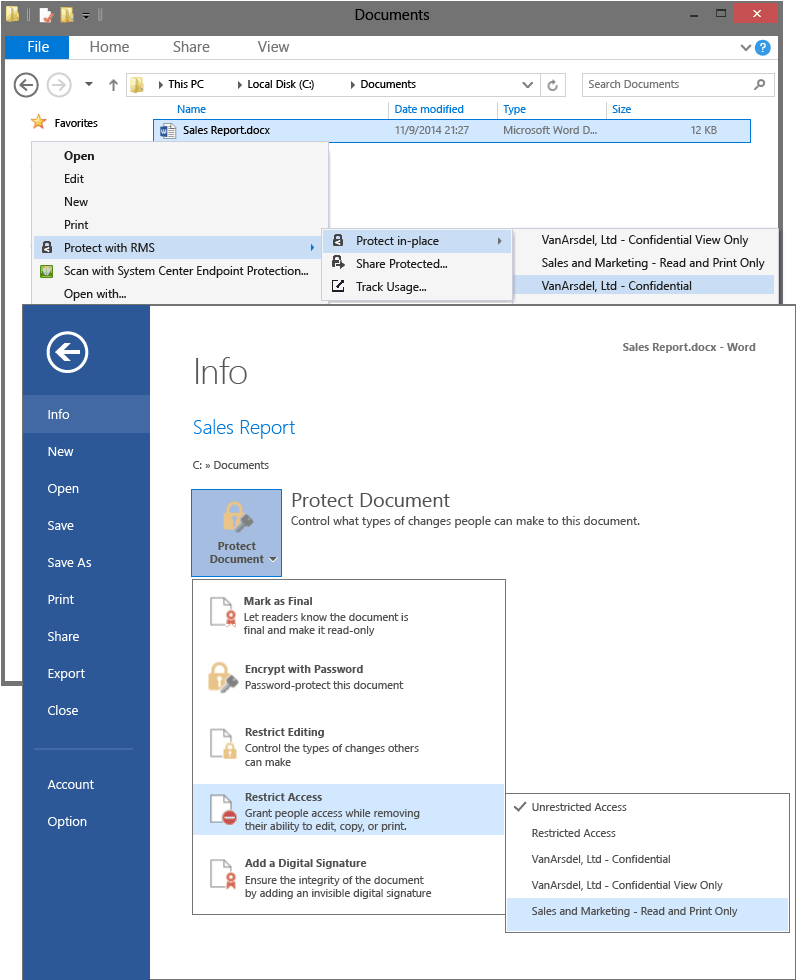

# Imagem de ecr&#227; inteiro: Selecione os modelos de RMS em aplica&#231;&#245;es, como o Explorador de ficheiros e no Word

Voltar ao [Azure RMS em ação: Ativar e configurar a gestão de direitos](http://technet.microsoft.com/library/jj585026.aspx)

