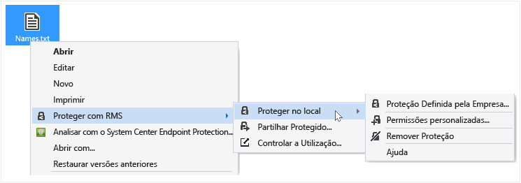
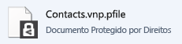

# Proteger um ficheiro num dispositivo (proteger no local) utilizando a aplica&#231;&#227;o de partilha Rights Management
Quando protege um ficheiro no local, este substitui o ficheiro original, que está desprotegido. Em seguida, pode deixar o ficheiro onde se encontra, copiá-la para outra pasta ou dispositivo ou partilhar a pasta que está a ser e o ficheiro permanece protegido. Também é possível anexar o ficheiro protegido a uma mensagem de correio eletrónico, embora a forma recomendada para partilhar um ficheiro protegido por e-mail seja diretamente a partir do Explorador de ficheiros ou uma aplicação do Office (consulte [Proteger um ficheiro para partilhar por e-mail ao utilizar a aplicação de partilha Rights Management](../Topic/Protect_a_file_that_you_share_by_email_by_using_the_Rights_Management_sharing_application.md)).

> [!TIP]
> Se vir algum erro quando tenta proteger ficheiros, consulte a [FAQ do Microsoft Rights Management partilha de aplicações para Windows](http://go.microsoft.com/fwlink/?LinkId=303971).

## Para proteger um ficheiro num dispositivo (proteger no local)

1.  No Explorador de ficheiros, selecione um ficheiro a proteger. Clique o botão direito, selecione **proteger com RMS**, e, em seguida, selecione **proteger no local**. Por exemplo:

    

    > [!NOTE]
    > Se não vir o **proteger com RMS** opção, é provável que a aplicação de partilha RMS não está instalada no seu computador, ou que o computador tem de ser reiniciado para concluir a instalação. Para obter mais informações sobre como instalar a aplicação de partilha RMS, consulte o artigo [Transferir e instalar a aplicação de partilha Rights Management](../Topic/Download_and_install_the_Rights_Management_sharing_application.md).

2.  Efetue um dos seguintes procedimentos:

    -   Selecione um modelo de política: Estas são permissões predefinidas que normalmente restringem o acesso e a utilização a pessoas na sua organização. Por exemplo, se o nome de organização for "Contoso, Lda.", poderá ver **Contoso, Lda. - apenas visualização confidencial**. Se esta for a primeira vez que protege um ficheiro neste computador, primeiro terá de selecionar **proteção definida pela empresa** para transferir os modelos.

        Da próxima vez que clicar a **proteger no local** opção, irá ver até 10 modelos à escolha. Se existirem mais de 10 modelos disponíveis e aquele que pretende não for apresentada, clique em **proteção definida pela empresa** para transferir e ver todos os modelos.

        Quando seleciona um modelo de política, também pode proteger vários ficheiros e uma pasta. Quando seleciona uma pasta, todos os ficheiros nessa pasta são selecionados automaticamente para proteção, mas os novos ficheiros que criar nessa pasta não serão automaticamente protegidos.

    -   Selecione **permissões personalizadas**: Escolha esta opção se os modelos não fornecerem o nível de proteção que necessita ou pretende definir explicitamente as opções de proteção. Especifique as opções que pretende para este ficheiro no [proteção caixa de diálogo Adicionar](http://technet.microsoft.com/library/dn574738.aspx), e, em seguida, clique em **aplicar**.

3.  Poderá ver momentaneamente uma caixa de diálogo indica que o ficheiro está a ser protegido e, em seguida, devolve o foco para o Explorador de ficheiros. O ficheiro ou ficheiros selecionados estão agora protegidos. Em alguns casos (quando a adição de proteção altera a extensão de nome de ficheiro), o ficheiro original no Explorador de ficheiros é substituído por um novo ficheiro que tenha o ícone de cadeado de proteção do Rights Management. Por exemplo:

    

Se mais tarde necessitar de remover a proteção de um ficheiro, consulte o artigo [Remover a proteção de um ficheiro, utilizando a aplicação de partilha Rights Management](../Topic/Remove_protection_from_a_file_by_using_the_Rights_Management_sharing_application.md).

## Exemplos e outras instruções
Para obter exemplos de como pode utilizar a aplicação e instruções sobre como proceder de partilha Rights Management, consulte as secções seguintes a partir do Guia do utilizador aplicação partilha Rights Management:

-   [Exemplos para utilizar a aplicação de partilha RMS](../Topic/Rights_Management_sharing_application_user_guide.md#BKMK_SharingExamples)

-   [O que pretende fazer?](../Topic/Rights_Management_sharing_application_user_guide.md#BKMK_SharingInstructions)

## Consultar Também
[Guia de utilizador de aplicação partilha do Rights Management](../Topic/Rights_Management_sharing_application_user_guide.md)

