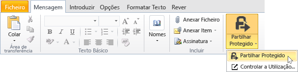

# Proteger um ficheiro para partilhar por e-mail ao utilizar a aplica&#231;&#227;o de partilha Rights Management
Quando protege um ficheiro para partilhar por correio eletrónico, cria uma nova versão do ficheiro original. O ficheiro original mantém-se desprotegido e a nova versão é protegida e automaticamente anexada a uma mensagem de e-mail que, em seguida, enviar.

Em alguns casos (para os ficheiros que são criados pela Microsoft Word, Excel e PowerPoint), a aplicação de partilha RMS cria duas versões do ficheiro, anexando-a mensagem de correio eletrónico. A segunda versão do ficheiro tem um **. ppdf** extensão de nome de ficheiro que é uma cópia sombra de volumes em PDF do ficheiro. Esta versão do ficheiro garante que os destinatários podem sempre ler o ficheiro, mesmo que não tenham a mesma aplicação instalada que utilizou para criá-la. Isto é, muitas vezes, as maiúsculas e minúsculas, quando as pessoas leem os e-mails em dispositivos móveis e pretende ver os respetivos anexos de correio eletrónico. Tudo o que precisam para abrir o ficheiro, é a aplicação de partilha RMS. Em seguida, poderão ler o ficheiro anexado, mas não poderão alterá-lo até abrirem a outra versão do ficheiro, utilizando uma aplicação que suporte RMS.

Se a sua organização utiliza o Azure RMS, pode manter um registo de ficheiros que protege ao partilhar:

-   Selecione uma opção para receber e-mails quando alguém tentar abrir estes anexos protegidos. Sempre que o ficheiro for acedido, será notificado quem tentou abrir o ficheiro e quando e se o fizeram com êxito (se foram autenticados com êxito) ou não.

-   Utilize a documentação do controlo do site. Ainda pode parar de partilhar o ficheiro, por revogação do acesso ao mesmo no site de controlo do documento. Para obter mais informações, consulte o artigo [Monitorizar e revogar os seus documentos ao utilizar a aplicação de partilha RMS](../Topic/Track_and_revoke_your_documents_when_you_use_the_RMS_sharing_application.md).

## Utilizar o Outlook: Para proteger um ficheiro para partilhar por e-mail

1.  Crie a mensagem de correio eletrónico e anexar o ficheiro. Em seguida, no **mensagem** separador o **RMS** grupo, clique em **partilhar protegido** e, em seguida, clique em **partilhar protegido** novamente:

    

    Se não vir este botão, é provável que a aplicação de partilha RMS não está instalada no seu computador, a versão mais recente não esteja instalada, ou que o computador tem de ser reiniciado para concluir a instalação. Para obter mais informações sobre como instalar a aplicação de partilha, consulte o artigo [Transferir e instalar a aplicação de partilha Rights Management](../Topic/Download_and_install_the_Rights_Management_sharing_application.md).

2.  Especifique as opções que pretende para este ficheiro no [partilhar a caixa de diálogo protegida](http://technet.microsoft.com/library/dn574738.aspx), e, em seguida, clique em **Enviar agora**.

### Outras formas de proteger um ficheiro para partilhar por e-mail
Para além de partilhar um ficheiro protegido utilizando o Outlook, também pode utilizar estes alternativas:

-   A partir do Explorador de ficheiros: Este método funciona para todos os ficheiros.

-   A partir de uma aplicação do Office: Este método funciona para as aplicações que a aplicação de partilha RMS suporta, utilizando o suplemento do Office, de modo a **RMS** grupo no Friso.

##### Utilizar o Explorador de ficheiros ou uma aplicação do Office: Para proteger um ficheiro para partilhar por e-mail

1.  Utilize uma das seguintes opções:

    -   No Explorador de ficheiros: Com o botão direito no ficheiro, selecione **proteger com RMS**, e, em seguida, selecione **partilhar protegido**:

        

    -   Para o Office aplicações, Word, Excel e PowerPoint: Certifique-se de que guardou o ficheiro pela primeira vez. Em seguida, no **base** separador o **RMS** grupo, clique em **partilhar protegido** e, em seguida, clique em **partilhar protegido** novamente:

        

    Se não vir estas opções de proteção, é provável que a aplicação de partilha RMS não está instalada no seu computador, a versão mais recente não esteja instalada, ou que o computador tem de ser reiniciado para concluir a instalação. Para obter mais informações sobre como instalar a aplicação de partilha, consulte o artigo [Transferir e instalar a aplicação de partilha Rights Management](../Topic/Download_and_install_the_Rights_Management_sharing_application.md).

2.  Especifique as opções que pretende para este ficheiro no [partilhar a caixa de diálogo protegida](http://technet.microsoft.com/library/dn574738.aspx), e, em seguida, clique em **Enviar**.

3.  Poderá ver momentaneamente uma caixa de diálogo para lhe indicar que o ficheiro está a ser protegido e, em seguida, verá uma mensagem de correio eletrónico criada para indicar os destinatários que são protegidos os anexos com Microsoft RMS e que deve iniciar sessão. Quando clicar na ligação para iniciar sessão, consulte as instruções e ligações para se certificar de que podem abrir o anexo protegido.

    Exemplo:

    

    Tem dúvidas sobre: [O que é o ficheiro. ppdf criado automaticamente?](../Topic/Dialog_box_options_for_the_Rights_Management_sharing_application.md#BKMK_PPDF)

4.  Opcional: Pode alterar tudo o que pretender nesta mensagem de correio eletrónico. Por exemplo, pode adicionar ou alterar o assunto ou o texto da mensagem.

    > [!WARNING]
    > Embora possa adicionar ou remover pessoas desta mensagem de correio eletrónico, isto não altera as permissões para o anexo que especificou no **partilha protegida** caixa de diálogo. Se pretender alterar estas permissões, por exemplo, atribuir permissões para abrir o ficheiro, feche a mensagem de correio eletrónico sem a guardar ou enviá-lo a uma pessoa nova e volte ao passo 1.

5.  Envie a mensagem de correio eletrónico.

## Exemplos e outras instruções
Para obter exemplos de como pode utilizar a aplicação e instruções sobre como proceder de partilha Rights Management, consulte as secções seguintes a partir do Guia do utilizador aplicação partilha Rights Management:

-   [Exemplos para utilizar a aplicação de partilha RMS](../Topic/Rights_Management_sharing_application_user_guide.md#BKMK_SharingExamples)

-   [O que pretende fazer?](../Topic/Rights_Management_sharing_application_user_guide.md#BKMK_SharingInstructions)

## Consultar Também
[Guia de utilizador de aplicação partilha do Rights Management](../Topic/Rights_Management_sharing_application_user_guide.md)

