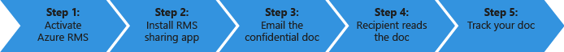

# Tutorial guia de introdu&#231;&#227;o para o Azure Rights Management
Utilize este tutorial rapidamente experimentar o Microsoft Azure Rights Management (também conhecido como o Azure RMS) para a sua organização com apenas 5 passos que deverá demorar menos de 15 minutos. Terá de ativar o serviço, enviar em segurança um documento confidencial por correio eletrónico para alguém à outra organização e, em seguida, poderá controlar quando esse documento é aberto. Quando o documento confidencial é enviado por correio eletrónico, é encriptada enquanto se encontram em trânsito e podem ser lidos apenas pela pessoa que é enviado, utilizando as permissões que são definidas pelo remetente.

Neste tutorial é diversificado os administradores de TI e consultores, para ajudar a avaliar o Azure Rights Management como uma solução de proteção de informações para uma organização. Num ambiente de produção, as instruções para ativar o serviço de teriam de ser feitas por um administrador e as instruções para enviar o documento seriam ser efetuadas por utilizadores finais. Ambos os conjuntos de instruções estão incluídos neste tutorial, para demonstrar o cenário de extremidade a extremidade de forma segura enviar um documento confidencial para alguém à outra organização. Se tiver dificuldades concluir neste tutorial, envie uma mensagem de correio eletrónico para [AskIPTeam](mailto:askipteam@microsoft.com?subject=Having%20problems%20with%20the%20Quick%20Start%20tutorial) e iremos ajudar a.

Para concluir este tutorial, terá o seguinte:

-   Uma subscrição que suporta a gestão de direitos do Azure. Isto pode ser uma subscrição paga ou de uma subscrição de avaliação. Se pretender utilizar o documento de controlo, o que é necessário para o passo 5 deste tutorial, a subscrição tem de suportar o controlo de documento. Para mais informações sobre as opções de subscrição e ligações para as versões de avaliação gratuitas, consulte o [Subscrições de nuvem que suportam o Azure RMS](../Topic/Requirements_for_Azure_Rights_Management.md#BKMK_SupportedSubscriptions) secção a [Requisitos para o Azure Rights Management](../Topic/Requirements_for_Azure_Rights_Management.md) tópico.

    Dica: Se precisar de obter uma subscrição, faça o seguinte com antecedência porque este processo, por vezes, pode demorar algum tempo a concluir.

-   Uma conta de administrador para iniciar sessão no Centro de administração do Office 365 ou no portal do Azure, para que pode ativar o serviço de gestão de direitos. Esta conta também tem de ter um endereço de e-mail e um serviço de correio eletrónico de trabalho (por exemplo, Exchange Online ou Exchange Server).

-   Um computador a executar o Windows (mínimo do Windows 7 SP1) e qual se encontre instalada 2016 do Office, Office 2013 ou Office 2010.

Vamos começar.

## Passo 1: Ativar o serviço de gestão de direitos

Apesar de poderá ter uma subscrição que suporta a gestão de direitos do Azure, o serviço está desativado por predefinição. Para ativá-lo, pode utilizar o Centro de administração do Office 365 ou do portal do Azure:

-   Se tiver uma subscrição do Office 365 que inclua Azure Rights Management, ou uma subscrição do Office 365 que exclui Azure Rights Management, mas tiver uma subscrição do Azure RMS autónomo: **Utilizar o Centro de administração do Office 365**.

-   Se não tiver uma subscrição do Office 365: **Utilizar o portal do Azure**.

#### Para ativar o Rights Management a partir do Centro de administração do Office 365

1.  Aceda ao [portal do Office 365](https://portal.office.com/) e inicie sessão com a sua conta escolar ou profissional.

2.  Se o Centro de administração do Office 365 não for apresentada automaticamente, selecione o ícone da aplicação de iniciador no canto superior esquerdo e escolha **Admin**. O **Admin** mosaico só aparece aos administradores do Office 365.

    > [!TIP]
    > Para obter ajuda do Centro de administração, consulte o artigo [Centro de administração sobre o Office 365 - ajuda da administração](https://support.office.com/article/About-the-Office-365-admin-center-Admin-Help-58537702-d421-4d02-8141-e128e3703547).

3.  No painel da esquerda, expanda **definições de serviço**.

4.  Clique em **Gestão de direitos de**.

5.  No **RIGHTS MANAGEMENT** página, clique em **Gerir**.

6.  No **Gestão de direitos de** página, clique em **Ativar**.

7.  Quando lhe for pedido **que pretende ativar o Rights Management?**, clique em **Ativar**.

Deverá ver **Rights management é ativado** e a opção para desativar (poderá ter de atualizar manualmente a página)

Neste momento, não clique em **funcionalidades avançadas**. Isto leva-o ao portal do Azure onde poderá configurar modelos e que não são necessários para este tutorial. Em vez disso, pode fechar o Centro de administração do Office 365.

#### Para ativar o Rights Management a partir do portal do Azure

1.  Aceda ao [portal do Azure](http://go.microsoft.com/fwlink/p/?LinkID=275081) e inicie sessão.

2.  No painel da esquerda, clique em **do Active Directory**.

3.  A partir de **do Active Directory** página, clique em **RIGHTS MANAGEMENT**.

4.  Selecione o diretório para gerir para [!INCLUDE[aad_rightsmanagement_2](../Token/aad_rightsmanagement_2_md.md)], clique em **ATIVAR**, e, em seguida, confirme a ação.

O **Estado da gestão de direitos** deverá agora apresentar **Active Directory** e **ATIVAR** opção é substituída pelo **DESATIVAR**.

Embora seja possível configurar outras opções para a gestão de direitos no portal, estas não são necessários para este tutorial, pelo que pode fechar o portal do Azure.

É tudo o que precisa para este passo primeiro. O serviço está ativado para que todos os utilizadores na sua organização podem agora começar a proteger documentos importantes e confidenciais. Num ambiente de produção, poderá querer restringir quem pode fazer isto inicialmente, para uma implementação faseada. Mas não é necessário para este tutorial.

Embora não incluídos aqui, para uma implementação de produção, provavelmente irá provavelmente também pretende configurar modelos personalizados. Modelos de tornam mais fácil para os utilizadores aplicar rapidamente as definições certas sempre que necessário proteger ficheiros. Quando ativar o Rights Management, obterá o 2 modelos predefinidos automaticamente e é provável que pretende de completar estes com os seus modelos personalizados num ambiente de produção. Mas modelos não são necessários para este tutorial, para que esteja pronto a utilizar para o passo seguinte.

|Se pretender obter mais informações|Informações adicionais|
|---------------------------------------|--------------------------|
|Sobre a ativação do Rights Management e controlar quem pode proteger ficheiros e correio eletrónico quando o serviço está ativado →|[Ativar o Azure Rights Management](../Topic/Activating_Azure_Rights_Management.md)|
|Sobre modelos predefinidos e como criar um novo, → modelos personalizados|[Configurar modelos personalizados para o Azure Rights Management](../Topic/Configuring_Custom_Templates_for_Azure_Rights_Management.md)|

## Passo 2: Instalar a aplicação de partilha Rights Management

A aplicação partilha Rights Management (também conhecido como "aplicação de partilha RMS") não é um requisito para o Azure Rights Management, mas recomendamos para todos os computadores e dispositivos móveis que suportem gestão de direitos do Azure. A aplicação de partilha RMS integra-se com o Office aplicações através da instalação de um escritório suplemento, para que os utilizadores facilmente podem proteger ficheiros diretamente a partir do Friso. Também torna possível proteger todos os tipos de ficheiros ao aplicar proteção genérica para ficheiros que não são suportados nativamente pela gestão de direitos do Azure e um site para utilizadores de monotorização de documentos para monitorizar e revogar ficheiros que estão protegidos. Vamos irá utilizar o documento de controlo do site posteriormente neste tutorial.

Esta aplicação é gratuita para transferir e oferece uma instalação com script para ambientes de produção. Mas, para este tutorial, iremos irá instalá-lo localmente.

#### Para transferir e instalar a aplicação de partilha Rights Management

1.  Aceda ao [Microsoft Rights Management](http://go.microsoft.com/fwlink/?LinkId=303970) página no Web site da Microsoft.

2.  No **computadores** secção, clique no ícone para o **aplicação RMS para Windows** e guarde o **Setup.exe** ficheiro para instalar a aplicação de partilha do Microsoft Rights Management.

3.  Para uma instalação local, tem de utilizar uma conta de administrador para executar o ficheiro de Setup.exe que foi transferido. Se lhe for pedido para continuar, clique em **Sim**.

4.  No **configurar o Microsoft RMS** página, clique em **seguinte**, e aguarde para concluir a instalação.

5.  Quando a instalação estiver concluída, clique em **Reiniciar** se lhe for pedido para reiniciar o computador, ou clique em  **Fechar** para concluir a instalação.

Agora está pronto para começar a proteger ficheiros que contêm informações que pretende partilhar, mas apenas com as pessoas que especificar.

|Se pretender obter mais informações|Informações adicionais|
|---------------------------------------|--------------------------|
|Sobre uma instalação local da aplicação para o Windows e o utilizador → de instruções de partilha Rights Management|[Guia de utilizador de aplicação partilha do Rights Management](http://technet.microsoft.com/library/dn339006.aspx)|
|Sobre a instalação com script da aplicação para o Windows e mais técnica → de informações de partilha Rights Management|[Guia partilha Rights Management aplicação administrador](http://technet.microsoft.com/library/dn339003.aspx)|
|Compreender a diferença entre proteção nativa e proteção genérica →|[O que é a diferença entre proteção genérica e proteção incorporada (nativa)?](https://technet.microsoft.com/library/dn574738.aspx)|

## Passo 3: O documento que pretende proteger de correio eletrónico

Para este passo, primeiro criar e guardar um documento do Word que irá representar o documento que pretende proteger e nome **Confidential.docx**. Para este tutorial, é irrelevante que texto, na verdade, contém, mas pretende que contêm algum texto, pelo que pode mais facilmente confirmar que o destinatário autorizado foi possível lê-lo. Por exemplo, escreva: **Se pode ler isto partir do seu anexo de correio eletrónico, o remetente com êxito partilhou um ficheiro que foi protegido com o Azure RMS.**

Em seguida, está pronto para partilhar de forma segura este documento por correio eletrónico.

#### Para partilhar de forma segura o documento por correio eletrónico

1.  Utilizar o Outlook, crie uma nova mensagem e anexe o ficheiro que acabou de criar.

2.  No **para** caixa, escreva um ou endereços de e-mail da empresa mais. Certifique-se de que especifique um endereço de e-mail empresarial, tal como **janetm@contoso.com** ou **p.dover@fabrikam.com** porque atualmente, o Azure Rights Management não suporta os endereços de e-mail pessoais que poderá utilizar em casa através do seu fornecedor de Internet. Não se preocupe se a pessoa que está a enviar para também tem de Azure Rights Management ou não.

3.  Escreva um assunto, tal como  **documento confidencial** e, em seguida, escreva uma mensagem curta para que o e-mail, tal como **Leia este documento confidencial e não partilhá-lo com outras pessoas.**

4.  Em seguida, no **mensagem** separador o **RMS** grupo, clique em **partilhar protegido** e, em seguida, clique em **partilhar protegido** novamente:

5.  No **partilha protegida** caixa de diálogo:

    1.  Selecione **Visualizador-ver apenas**.

        Isto significa que o nosso destinatários poderão ver o documento, mas não editar ou imprimir.

    2.  Selecione **E-Mail-me quando alguém tentar abrir estes documentos**.

        Receberá uma notificação por e-mail sempre que os destinatários tentam abrir o anexo e também se outra pessoa tentar abri-lo — por exemplo, o destinatário reencaminha a mensagem de correio eletrónico para colega de trabalho. Neste cenário última, verá que o acesso foi negado e de detalhes de utilizador, pode decidir se pretende enviar uma cópia do documento que podem abrir essa pessoa.

    3.  Selecione **Permitir-me a revogação instantânea do acesso a estes documentos**.

        Esta opção requer que os destinatários com uma ligação à Internet sempre que abrirem o anexo, mas com o benefício que se mais tarde revogar o documento, da próxima vez que tentarem abri-lo, não será possível. Se não selecionar esta opção, os destinatários poderão conseguir abri-lo, mesmo sem uma ligação à Internet, mas com a desvantagem que se mais tarde revogar o documento, poderá haver um atraso de quando que entra em vigor.

    4.  Clique em **Enviar agora**.

        Mensagem de correio eletrónico com anexo é enviada para os endereços de e-mail que especificou. Para além da sua mensagem de correio eletrónico, Verão instruções como ler o documento anexado que seja protegido pelo Azure Rights Management.

Agora que enviou o documento protegido, está pronto para pedir os seus destinatários de aguardar até que vão e, em seguida, abri-lo. Mas não feche o Outlook, uma vez que podemos irá utilizá-lo novamente no nosso passo final para controlar o anexo.

|Se pretender obter mais informações|Informações adicionais|
|---------------------------------------|--------------------------|
|Métodos alternativos para proteger os ficheiros para partilhar por e-mail → e obter instruções completas|[Proteger um ficheiro para partilhar por e-mail ao utilizar a aplicação de partilha Rights Management](https://technet.microsoft.com/library/dn574735.aspx)|
|Sobre as opções no **partilha protegida** caixa de diálogo →|[Opções da caixa de diálogo para a aplicação de partilha Rights Management](https://technet.microsoft.com/library/dn574738.aspx)|

## Passo 4: Pedir os seus destinatários para abrir o documento por correio eletrónico

Os destinatários podem utilizar vários dispositivos para ler o documento protegido enviado como anexo de correio eletrónico. Os dispositivos incluem iPads, iPhones, Android tablets e telefones, computadores Mac, bem como computadores com o Windows.

Peça-lhes para ler a mensagem de e-mail que enviou. Irão ver a mensagem de correio eletrónico e antes que o seguinte texto:

**O remetente tenha protegido os anexos com Microsoft RMS. Tem** [sessão](http://aka.ms/rms) **para abri-los.**

Quando clicar na ligação, que demora-los com instruções para instalar a aplicação de partilha RMS e inicie sessão se for necessário, para uma conta gratuita. A conta gratuita concede aos-las uma subscrição para o RMS para indivíduos, que garante que os utilizadores autorizados podem sempre ler um documento protegido, mesmo se a organização não tiver o Azure RMS. Em seguida, está preparados para ler o anexo protegido utilizando as instruções seguintes.

#### Para ver o anexo do documento protegido

1.  Como Azure Rights Management protegidas num documento do Word, existem dois anexos da mensagem de e-mail. Estas são, na verdade, duas versões do mesmo ficheiro, mas com extensões de nome de ficheiro diferente. Abra a versão que tenha o **.ppdf** extensão de nome de ficheiro (**Confidential.ppdf**).

    Se tiver uma versão do [Office no seu dispositivo que suporte o Rights Management](https://technet.microsoft.com/library/dn655136.aspx), pode abrir a outra versão do ficheiro (**Confidential.docx**), de modo a que é aberto no Word.

2.  Se lhe for pedido para o seu nome de utilizador e palavra-passe, introduza o seu nome de utilizador no mesmo formato como o endereço de e-mail que foi utilizado para enviar o correio eletrónico e o anexo. Por exemplo, **janetm@contoso.com** ou **p.dover@fabrikam.com**. Para a sua palavra-passe, escreva a palavra-passe que especificou quando se inscreveu para RMS para indivíduos. Ou, se a sua organização tiver Azure RMS, introduza a palavra-passe de trabalho habituais.

O documento é aberto e agora pode ler o conteúdo. Por exemplo, poderá dizer que **se pode ler isto partir do seu anexo de correio eletrónico, o remetente com êxito partilhou um ficheiro que foi protegido com o Azure RMS** Porque é só de leitura, não é possível alterar o conteúdo.

Como um passo opcional, foi peça ao seu destinatário para reencaminhar o e-mail para outras pessoas que não tenha incluído no seu e-mail original. Mesmo que as outras pessoas de uma organização que tenha Azure Rights Management profissional ou aplicam-se para os seus próprios RMS para a subscrição de indivíduos, não poderão abrir o anexo. Quando estes são promovidos para o respetivo nome de utilizador, acesso ao documento será rejeitado.

Agora que o destinatário tem de abrir o anexo e, opcionalmente, reencaminhadas-la para outra pessoa, espera-se obter uma notificação de correio eletrónico que relatórios esta atividade. Mas mensagens de correio eletrónico são fáceis de perder ao longo do tempo, para que uma melhor forma de controlar quem aceder ao seu documento é utilizar o site, o que é abrangido no último passo de monotorização de documentos.

|Se pretender obter mais informações|Informações adicionais|
|---------------------------------------|--------------------------|
|Obter instruções completas para visualização de ficheiros que estão protegidos pelo Azure Rights Management →|[Ver e utilizar ficheiros que foram protegidos por Rights Management](https://technet.microsoft.com/library/dn574741.aspx)|
|Sobre a subscrição gratuita, RMS para indivíduos →|[RMS para indivíduos e Azure Rights Management](../Topic/RMS_for_Individuals_and_Azure_Rights_Management.md)|
|Sobre as duas versões do ficheiro que verá anexado à mensagem de correio eletrónico →|[O que é o ficheiro. ppdf criado automaticamente?](https://technet.microsoft.com/library/dn574738.aspx)|

## Passo 5: Controlar o seu documento protegido

> [!NOTE]
> Para este passo, tem de ter uma subscrição que suporta o controlo de documento. Para verificar se a sua subscrição incluir monotorização documentos, consulte o artigo [ofertas de comparação do Rights Management Services (RMS)](https://technet.microsoft.com/dn858608.aspx).

Este passo é opcional, mas a maioria das pessoas gosta de saber se o anexo que enviada às pessoas ter sido aberto, quando e até mesmo a partir da qual. Por exemplo:

-   Está estava à espera uma resposta a partir de uma pessoa por um período de tempo especificado e pode ver o site de controlo do documento que ela ainda não tenha aberto o documento mesmo que está a atingir o prazo. Enviar-lhe um e-mail de seguimento ou telefone ao mesmo como um lembrete atempadamente.

-   Depois de vê que alguém abriu o documento, dar seguimento pedir dela se ela tem todas as perguntas ou necessita de informações adicionais.

#### Para controlar o seu documento protegido

1.  Utilizar o Outlook, no **base** separador o **RMS** grupo, clique em **controlar a utilização**.

2.  Se vir o **proteger e partilhar nos seus termos** página, clique em **sessão** e fornecer o nome de utilizador e palavra-passe novamente.

3.  No **os documentos partilhados** página, irá ver o documento que anexado à mensagem de e-mail, **Confidential.docx**. Neste momento, é o único ficheiro apresentado, mas como partilhar documentos protegidos adicionais, a lista irá aumentar.

    A partir desta página, irá ver quando partilhou o documento (quando que enviou a mensagem de correio eletrónico com o anexo protegido), a data da última atividade e o nome do destinatário que enviou a mensagem de correio eletrónico para. Clique no nome do documento para obter detalhes adicionais.

4.  A nova página, que tem o nome do ficheiro que em que clicou, poderá ver detalhes de resumo para apenas esse documento e uma lista de outras opções que estão disponíveis para o documento (**lista**, **linha cronológica**, **mapa**, **definições**).

    Clique em cada opção para explorar formas diferentes para controlar o seu documento protegido. Ou, ainda no **resumo** página, clique em **Abrir no Excel** para exportar as informações numa folha de cálculo, ou clique em **revogar o acesso** para parar de partilhar o documento.

Pode voltar a este site para controlar a atividade para o seu documento protegido ou revogar o acesso se for necessário. Ainda pode aceder ao site do seu dispositivo móvel ou tablet, utilizando um browser com esta ligação: [documento controlo](http://go.microsoft.com/fwlink/?LinkId=529562)

|Se pretender obter mais informações|Informações adicionais|
|---------------------------------------|--------------------------|
|Obter instruções completas para controlar o seu → de documentos|[Monitorizar e revogar os seus documentos ao utilizar a aplicação de partilha RMS](https://technet.microsoft.com/library/dn986611.aspx)|
|Minuto dois vídeo que explica e mostra monotorização → documentos|[Controlo de documento do Azure RMS e de revogação.](http://channel9.msdn.com/Series/Information-Protection/Azure-RMS-Document-Tracking-and-Revocation)|
|Para apoio a clientes e resolução de problemas → perguntas|[FAQ para o controlo de documento](https://technet.microsoft.com/dn947488)|

## Próximos passos
Neste tutorial stepped através de apenas um cenário de como o Azure RMS pode ajudar a proteger os seus dados. Para ver outras utilizações comuns, consulte o [Azure RMS em ação](https://technet.microsoft.com/library/jj585026.aspx) secção a partir de [O que é o Azure Rights Management?](../Topic/What_is_Azure_Rights_Management_.md) artigo. Existem outras secções neste artigo que também pode achar úteis, tais como como funciona o Azure RMS e os problemas de empresas pode resolver.

Se estiver pronto para iniciar a implementação do Azure RMS, utilize o [Plano de implementação do Azure Rights Management](../Topic/Azure_Rights_Management_Deployment_Roadmap.md) para os passos de implementação e ligações para instruções sobre como proceder.

## Consultar Também
[Introdução ao Azure Rights Management](../Topic/Getting_Started_with_Azure_Rights_Management.md)

