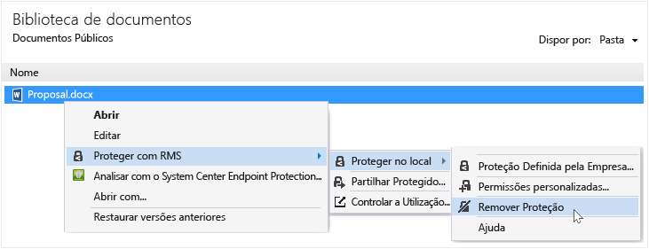

# Remover a prote&#231;&#227;o de um ficheiro, utilizando a aplica&#231;&#227;o de partilha Rights Management
Para remover a proteção de um ficheiro (ou seja, desproteger um ficheiro) anteriormente protegido utilizando a aplicação de partilha RMS, utilize o **Remover proteção** opção do Explorador de ficheiros.

> [!IMPORTANT]
> Tem de ser um proprietário do ficheiro para remover a proteção.

### Para remover a proteção de um ficheiro

1.  A partir do Explorador de ficheiros, com o botão direito no ficheiro (por exemplo, amostra. ptxt), selecione **proteger com RMS**, clique em **proteger no local**, e, em seguida, clique em **Remover proteção**:

    

    Poderá ser-lhe pedido para credenciais.

O ficheiro protegido original é eliminado (por exemplo, amostra. ptxt) e substituído com um ficheiro que tem o mesmo nome mas com a extensão de nome de ficheiro não protegido (por exemplo, amostra).

## Exemplos e outras instruções
Para obter exemplos de como pode utilizar a aplicação e instruções sobre como proceder de partilha Rights Management, consulte as secções seguintes a partir do Guia do utilizador aplicação partilha Rights Management:

-   [Exemplos para utilizar a aplicação de partilha RMS](../Topic/Rights_Management_sharing_application_user_guide.md#BKMK_SharingExamples)

-   [O que pretende fazer?](../Topic/Rights_Management_sharing_application_user_guide.md#BKMK_SharingInstructions)

## Consultar Também
[Guia de utilizador de aplicação partilha do Rights Management](../Topic/Rights_Management_sharing_application_user_guide.md)

