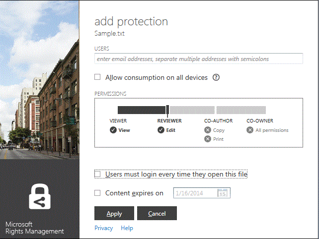

# Vers&#227;o Revista 3: Guia da aplica&#231;&#227;o de partilha Microsoft Rights Management
Utilize este guia da aplicação de partilha Microsoft Rights Management (RMS) para Windows para ajudar a proteger documentos e imagens importantes de pessoas que não os deveriam ver, mesmo se os enviar por e-mail ou os guardar noutro dispositivo. De igual forma, esta aplicação permite abrir e utilizar ficheiros que tenham sido protegidos por terceiros utilizando a mesma tecnologia de Rights Management.

Esta aplicação de partilha fornece esta proteção aos seus ficheiros das seguintes formas:

-   Adiciona funcionalidade ao Explorador de Ficheiros (também conhecido como Explorador do Windows no Windows 7 e versões anteriores) para que, quando gerir ficheiros numa pasta, possa proteger facilmente um único ficheiro, proteger em massa vários ficheiros ou proteger todos os ficheiros numa pasta.

-   Fornece proteção a todos os tipos de ficheiro e tem um visualizador incorporado para tipos de ficheiro de texto e imagem utilizados frequentemente.

-   Adiciona o botão **Partilhar Protegido** à barra de ferramentas do Microsoft Office para Word, PowerPoint e Excel.

Tudo o que necessita é de um computador com o Windows 7 ou o Windows 8 e uma conta de administrador local para instalar a aplicação de partilha RMS. Em seguida, transfira e instale esta aplicação gratuita da Microsoft.

Caso haja questões que não sejam abordadas neste guia, consulte [FAQ da Aplicação de Partilha Microsoft Rights Management para Windows](http://go.microsoft.com/fwlink/?LinkId=303971).

## Exemplos para utilizar a aplicação de partilha RMS
Seguem-se alguns exemplos de como pode utilizar a aplicação de partilha RMS para ajudar a proteger os seus ficheiros.

|Cenário|Solução utilizando a aplicação de partilha RMS|
|-----------|--------------------------------------------------|
|**Pretendo copiar em segurança um documento confidencial da empresa para outro dispositivo**<br /><br />Está a utilizar o seu PC para trabalhar num documento de estratégia confidencial da empresa e pretende copiá-lo para uma pen USB para poder continuar a trabalhar no mesmo quando sair do escritório e não tiver acesso à rede da empresa.|Tem a aplicação de partilha RMS instalada no PC e no portátil. Utiliza o Explorador de Ficheiros no PC para proteger o ficheiro utilizando um modelo, para que não possa ser acedido por pessoas fora da empresa. Em seguida, copia o ficheiro para a pen, liga-a ao portátil e continua a trabalhar no documento. Se perder a pen ou o portátil for roubado, ninguém fora da empresa poderá aceder ao documento.|
|**Pretendo partilhar em segurança informações financeiras com uma pessoa em quem confio fora da minha organização**<br /><br />Trabalha com uma empresa parceira e pretende enviar um e-mail com uma folha de cálculo do Excel que contém números de vendas estimados. Pretende que consigam ver os números, mas não alterá-los.|Utilize o botão **Partilhar Protegido** no friso do Excel, escreva os endereços de e-mail das duas pessoas com quem trabalha na empresa parceira, selecione **Visualizador** no controlo de deslize e clique em **Enviar**.<br /><br />Quando o e-mail for entregue à empresa parceira, apenas os destinatários no e-mail podem ver a folha de cálculo e não podem guardar, editar, imprimir ou reencaminhá-la.|
|**Preciso de enviar em segurança um diagrama de engenharia por e-mail a uma pessoa que utiliza um dispositivo iOS**<br /><br />A sua empresa utiliza uma aplicação de engenharia personalizada e pretende enviar por e-mail um diagrama altamente confidencial a um colega que verifica regularmente o e-mail no respetivo dispositivo iOS.|Utilize o Explorador de Ficheiros para clicar com o botão direito do rato no ficheiro, e selecione **Partilhar Protegido**. A aplicação de partilha RMS reconhece que a extensão de ficheiro não é de uma aplicação que suporta nativamente o RMS, pelo que, quando anexa o ficheiro a uma mensagem de e-mail, converte-o automaticamente para um ficheiro protegido genericamente e seleciona automaticamente a opção **Permitir consumo em todos os dispositivos**.<br /><br />O destinatário recebe o e-mail no dispositivo iOS, clica na ligação do e-mail que o informa como transferir a aplicação de partilha RMS, instala a versão para dispositivos iOS e, por fim, visualiza o diagrama.|
|**A minha empresa não utiliza o Rights Management, mas recebi uma mensagem de e-mail com um anexo protegido por RMS**<br /><br />O remetente do e-mail é uma pessoa em quem confia, porque fez negócio com ela anteriormente e suspeita que lhe está a enviar informações sobre uma potencial nova oportunidade de negócio.|Clica na ligação no e-mail que indica como transferir a aplicação de partilha RMS para o computador, instala-a e, em seguida, inscreve-se no RMS para utilizadores. A Microsoft confirma que a sua organização não tem uma subscrição do Office 365, envia-lhe um e-mail para concluir o processo de inscrição gratuito, e inicia sessão com a sua nova conta. Em seguida, pode abrir o anexo do e-mail para ler sobre a nova oportunidade de negócio.|

## <a name="BKMK_Install"></a>Como transferir e instalar a aplicação de partilha RMS
> [!IMPORTANT]
> Tem de ter uma conta de administrador local para instalar a aplicação de partilha RMS. Se não iniciar sessão como administrador local, pode utilizar a opção **Executar como administrador** quando executar o Setup.exe no passo 3.

Para instalar a aplicação de partilha RMS, siga estes passos:

1.  Aceda à página [Microsoft Rights Management](http://go.microsoft.com/fwlink/?LinkId=303970) no site da Microsoft.

2.  Na secção **Computadores**, clique no ícone da **aplicação RMS para Windows** e guarde o pacote de instalação da aplicação de partilha Microsoft Rights Management no computador.

3.  Faça duplo clique no ficheiro comprimido que foi transferido e, em seguida, faça duplo clique em **setup.exe**. Se lhe for perguntado se pretende continuar, clique em **Sim**.

4.  Na página **Configurar o Microsoft RMS**, clique em **Seguinte** e aguarde que a instalação seja concluída.

5.  Quando a instalação estiver concluída, clique em **Reiniciar** para reiniciar o computador e concluir a instalação. Em alternativa, clique em **Fechar** e reinicie o computador mais tarde para concluir a instalação.

Está agora pronto para começar a proteger os seus ficheiros ou ler ficheiros protegidos por outras pessoas.

## <a name="BKMK_UsingMSRMSApp"></a>O que pretende fazer?
Utilize as seguintes instruções para o ajudar a trabalhar com ficheiros protegidos.

### <a name="BKMK_CreatePTXT"></a>Criar um ficheiro de texto protegido
Pode converter um ficheiro de texto normal (.txt) num ficheiro protegido que passa a ter a extensão de ficheiro .ptxt.

##### Para criar um ficheiro de texto protegido (.ptxt)

1.  No Explorador de Ficheiros, clique com o botão direito do rato numa pasta, clique em **Novo** e, em seguida, clique em **Documento de Texto**.

2.  Mude o nome do ficheiro (por exemplo, Amostra.txt).

3.  Faça duplo clique no ficheiro para o abrir no Bloco de notas.

4.  No Bloco de Notas, adicione algumas linhas de texto ao ficheiro e, em seguida, guarde-o. Pode utilizar o seguinte como texto de exemplo.

    ```
    This is a sample text file.
    This is a sample text file.
    This is a sample text file.
    This is a sample text file. 
    This is a sample text file.
    This is a sample text file.
    ```

5.  Clique com o botão direito do rato no ficheiro, clique em **Proteger no local** e selecione um modelo na lista. Se foi a primeira vez que utilizou a aplicação de partilha RMS, terá de selecionar primeiro **Proteção da Empresa**, o que transfere os modelos para a sua organização.

6.  No ecrã **Aplicação de partilha Microsoft Rights Management**, confirme a política que pretende aplicar, clique em **Aplicar** e, depois de o ficheiro ser protegido, clique em **Fechar**.

### <a name="BKMK_ViewPTXT"></a>Ver um ficheiro de texto protegido (.ptxt) ou um ficheiro de imagem protegido
Para ver um ficheiro de texto protegido (.ptxt), no Explorador de Ficheiros, faça duplo clique no ficheiro (por exemplo, Amostra.ptxt). Poderão ser-lhe pedidas credenciais. Quando o ficheiro for aberto, verá a política de proteção na parte superior do ficheiro.

Visualize e abra imagens protegidas da mesma forma.

### <a name="BKMK_CreatePFILE"></a>Criar um ficheiro protegido genérico
Utilize o formato de ficheiro de proteção genérica (.pfile) para oferecer um nível genérico de proteção para tipos de ficheiro não suportados diretamente pela aplicação de partilha RMS ou outras aplicações que fornecem proteção de tipo RMS incorporada. Pode utilizar a página [Microsoft Rights Management](http://go.microsoft.com/fwlink/?LinkId=303970) no site da Microsoft para verificar rapidamente as aplicações que suportam a proteção incorporada do RMS.

Por exemplo, visto que o Microsoft Visio não suporta atualmente a proteção incorporada para o RMS, pode utilizar a proteção genérica para ficheiros .vsd criados com o Microsoft Visio.

> [!TIP]
> Qual a diferença entre proteção incorporada (nativa) e proteção genérica?
> 
> -   Quando protege genericamente um ficheiro, pessoas não autorizadas não podem abrir o ficheiro. Mas, depois de pessoas autorizadas abrirem o ficheiro, podem reencaminhá-lo desprotegido para outras pessoas ou guardá-lo numa localização que pode ser acedida por outras pessoas. No entanto, visualizam uma mensagem na parte superior do ficheiro que indica as permissões que têm para o ficheiro e é-lhes pedido que as cumpram, mas esta proteção não pode ser imposta. Além disso, quando protege genericamente um ficheiro, não pode restringir as permissões além da autorização. Por exemplo, se utilizar permissões personalizadas, o controlo de deslize na aplicação de partilha RMS seleciona automaticamente **COPROPRIETÁRIO** e não pode alterar para permissões mais restritivas, como **VISUALIZADOR** ou **COAUTOR**.
> -   Em comparação, quando utiliza a proteção incorporada do RMS com aplicações que a suportam (por exemplo, ficheiros do Office), a proteção é aplicada ao ficheiro mesmo se este for enviado a outra pessoa ou guardado noutra localização. Quando protege estes ficheiros, pode utilizar permissões restritivas como só de leitura ou a permissão para editar, mas não para imprimir ou copiar. Por exemplo, se utilizar permissões personalizadas, o controlo de deslize na aplicação de partilha RMS seleciona automaticamente **REVISOR** para as permissões, que pode depois alterar para serem mais ou menos restritivas.

##### Exemplo: Para criar um ficheiro protegido genérico (.pfile) a partir de um ficheiro de desenho do Visio (.vsd)

1.  No Explorador de Ficheiros, clique com o botão direito do rato numa pasta, clique em **Novo** e, em seguida, clique em **Novo Documento do Visio**.

2.  Mude o nome do ficheiro (por exemplo, Amostra.vsd).

3.  Faça duplo clique no ficheiro para o abrir no Visio.

4.  No Visio, adicione elementos ao desenho e, em seguida, guarde e feche o ficheiro.

5.  Clique com o botão direito do rato no ficheiro, clique em **Proteger no local** e selecione um modelo de política na lista. Se foi a primeira vez que utilizou a aplicação de partilha RMS, terá de selecionar primeiro **Proteção da Empresa**, o que transfere os modelos para a sua organização.

6.  No ecrã **Aplicação de partilha Microsoft Rights Management**, selecione a política que pretende aplicar e, em seguida, clique em **Aplicar**.

7.  Uma mensagem indica que o ficheiro protegido foi guardado como ficheiro .pfile (por exemplo, Amostra.vsd.pfile). O ficheiro original é eliminado.

### <a name="BKMK_ViewPFILE"></a>Ver um ficheiro protegido genérico (.pfile)
Para ver um ficheiro protegido genérico (.pfile), no Explorador de Ficheiros, faça duplo clique no ficheiro protegido genérico (.pfile) (por exemplo, Amostra.vsd.pfile) e clique em **Abrir**.

### <a name="BKMK_Unprotect"></a>Remover a proteção de um ficheiro
Para remover a proteção de um ficheiro (ou seja, desproteger um ficheiro) anteriormente protegido, utilize a opção **Remover Proteção**:

1.  Clique com o botão direito do rato no ficheiro (por exemplo, Amostra.ptxt), clique em **Proteger no local** e, em seguida, clique em **Remover Proteção**. Poderão ser-lhe pedidas credenciais.

2.  O ficheiro original protegido é eliminado (por exemplo, Amostra.ptxt) e substituído por um ficheiro com o mesmo nome, mas com a extensão de nome de ficheiro desprotegida (por exemplo, Amostra.txt).

### <a name="BKMK_ProtectCustom"></a>Proteger um ficheiro com as suas próprias permissões personalizadas
A forma mais fácil de proteger um ficheiro é utilizar modelos, mas também pode especificar as suas próprias permissões. A isto chama-se proteção criada pelo utilizador, e é útil para as seguintes situações:

-   Pretende limitar o acesso ao ficheiro a apenas uma lista específica de utilizadores individuais identificados pelos respetivos endereços de e-mail.

-   Pretende limitar a utilização do ficheiro a apenas direitos específicos, como direitos só de leitura para um documento.

Para proteger um ficheiro com permissões criadas pelo utilizador, clique com o botão direito do rato no ficheiro, clique em **Proteger no local** e, em seguida, clique em **Permissões Personalizadas**. Verá o seguinte ecrã:



Escreva os endereços de e-mail dos utilizadores, utilize o controlo de deslize para selecionar as permissões do ficheiro e, em seguida, clique em **Aplicar**.

### <a name="BKMK_UserDefined"></a>Utilizar ficheiros com proteção personalizada
A maioria dos ficheiros protegidos que abre terão sido protegidos através da aplicação de modelos. No entanto, os utilizadores também podem proteger ficheiros utilizando as suas próprias permissões personalizadas, designado por proteção criada pelo utilizador.

Para formatos de ficheiros de texto e imagem, este nível de proteção requer que todas as aplicações utilizadas para editar, guardar ou restringir estes ficheiros tenham sido concebidas para suportar a proteção RMS e implementem as APIs de proteção fornecidas no SDK do AD RMS.

Quando visualiza um ficheiro de texto protegido com proteção criada pelo utilizador, observará uma ligeira diferença nas permissões à medida que são apresentadas para o ficheiro, conforme mostrado no exemplo seguinte.

Para os ficheiros protegidos utilizando o formato de ficheiro de proteção genérica (.pfile), os direitos ou permissões especificadas pelo utilizador são apresentadas no ecrã de confirmação em vez do nome do modelo utilizado para proteger o ficheiro, conforme mostrado na imagem seguinte.


### <a name="BKMK_ShareProtected"></a>Proteger conteúdo a partilhar por e-mail
Para proteger conteúdo que pretende partilhar através de uma mensagem de e-mail, clique com o botão direito do rato no ficheiro e clique em **Partilhar Protegido**. Verá o seguinte ecrã:


Escreva os endereços de e-mail da lista de utilizadores, utilize o controlo de deslize para selecionar as permissões do ficheiro e clique em **Enviar**. Em seguida, o Outlook cria uma mensagem de e-mail para os destinatários com uma breve mensagem que pode alterar, e anexa o ficheiro protegido. O ficheiro original não fica protegido.

Para permitir que as pessoas visualizem ficheiros protegidos em dispositivos não Windows, clique em **Permitir consumo em todos os dispositivos**. Os utilizadores podem ter de transferir a aplicação de partilha RMS para o respetivo dispositivo, e existe uma ligação para fazê-lo no e-mail.

### <a name="BKMK_Multiple"></a>Aplicar proteção a vários ficheiros e pastas
Não tem de aplicar proteção a ficheiros um a um quando utiliza o Explorador de Ficheiros. Em vez disso, pode selecionar vários ficheiros ou todos os ficheiros numa pasta, caso ainda não estejam protegidos.

##### Para proteger vários ficheiros ou todos os ficheiros numa pasta selecionada

1.  No Explorador de Ficheiros, selecione vários ficheiros ou uma pasta que contenha os ficheiros a proteger.

2.  Clique com o botão direito do rato na pasta ou nos ficheiros selecionados, clique em **Proteger no local** e selecione um modelo na lista. Se foi a primeira vez que utilizou a aplicação de partilha RMS, terá de selecionar primeiro **Proteção da Empresa**, o que transfere os modelos para a sua organização.

3.  No ecrã **Aplicação de partilha Microsoft Rights Management**, confirme se os ficheiros foram protegidos.

> [!TIP]
> Se vir algum erro, consulte [FAQ da Aplicação de Partilha Microsoft Rights Management para Windows](http://go.microsoft.com/fwlink/?LinkId=303971).

### <a name="BKMK_OfficeToolbar"></a>Utilizar o suplemento da barra de ferramentas do Office
Pode proteger e partilhar ficheiros no Word, PowerPoint e Excel diretamente a partir do Microsoft Office, utilizando o suplemento do friso do Office para a aplicação de partilha Microsoft Rights Management.

No grupo **Proteção**, clique em **Partilhar Protegido** para iniciar a aplicação de partilha Microsoft Rights Management.


### <a name="BKMK_AccessKeys"></a>Utilizar atalhos de teclado
Prima a tecla **Alt** para ver as teclas de acesso disponíveis e, em seguida, prima **Alt** + a tecla de acesso para selecionar uma opção.

Por exemplo, na caixa de diálogo **partilhar protegido**, prima **Alt** para ver as teclas de acesso e, em seguida, prima **Alt + u** para selecionar a caixa de verificação **Os utilizadores têm de iniciar sessão sempre que abrem este ficheiro**.


## Consultar Também
[Transferência da aplicação de partilha Microsoft Rights Management](http://go.microsoft.com/fwlink/?LinkId=303970)
 [FAQ da Aplicação de Partilha Microsoft Rights Management para Windows](http://go.microsoft.com/fwlink/?LinkId=303971)

