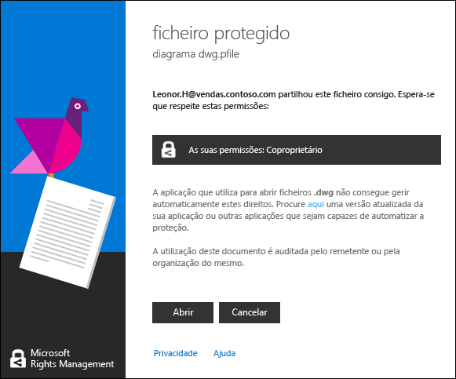
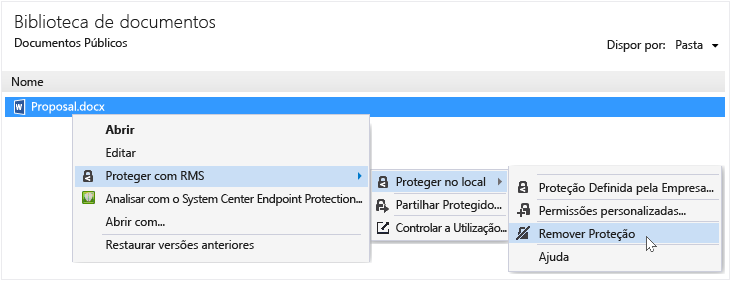
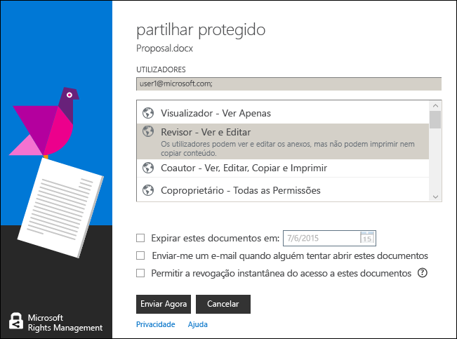

# Guia de utilizador da aplica&#231;&#227;o de partilha Rights Management - revis&#227;o para t&#243;pico &#250;nico
A aplicação de partilha Microsoft Rights Management (RMS) para Windows ajuda a proteger documentos e imagens importantes de pessoas que não os deveriam ver, mesmo se os enviar por e-mail ou os guardar noutro dispositivo. Também pode utilizar esta aplicação para abrir e utilizar ficheiros que tenham sido protegidos por terceiros utilizando a mesma tecnologia de Rights Management.

Só precisa de um computador que execute, pelo menos, o Windows 7, e uma conta de administrador local para instalar a aplicação de partilha RMS. Em seguida, [transfira e instale](http://go.microsoft.com/fwlink/?LinkId=303970) esta aplicação gratuita da Microsoft.

Caso haja questões que não sejam abordadas neste guia, consulte [FAQ da Aplicação de Partilha Microsoft Rights Management para Windows](http://go.microsoft.com/fwlink/?LinkId=303971).

Seguem-se alguns exemplos de como pode utilizar a aplicação de partilha para ajudar a proteger ficheiros.

|Pretendo...|Como efetuar este procedimento|
|---------------|----------------------------------|
|**… partilhar em segurança informações financeiras com uma pessoa em quem confio fora da minha organização**  Trabalha com uma empresa parceira e pretende enviar um e-mail com uma folha de cálculo do Excel que contém números de vendas estimados. Pretende que consigam ver os números, mas não alterá-los.|Utilize o botão Partilhar Protegido no friso do Excel, escreva os endereços de e-mail das duas pessoas com quem trabalha na empresa parceira, selecione Visualizador no controlo de deslize e clique em Enviar.  Quando o e-mail for entregue à empresa parceira, apenas os destinatários no e-mail podem ver a folha de cálculo e não podem guardar, editar, imprimir ou reencaminhá-la.  Detalhes: Consulte **Proteger um ficheiro para partilha por e-mail** na secção [O que pretende fazer?](../Topic/Rights_Management_sharing_application_user_guide_-_revision_for_single_topic.md#BKMK_UsingMSRMSApp) deste guia.|
|**… enviar um documento por e-mail de forma segura a uma pessoa que utiliza um dispositivo iOS**  Pretende enviar por e-mail um documento do Word altamente confidencial a um colega que sabe que verifica regularmente o e-mail num dispositivo iOS.|Utilize o Explorador de Ficheiros para clicar com o botão direito do rato no ficheiro, e selecione Partilhar Protegido. Na aplicação de partilha RMS, selecione a opção Permitir consumo em todos os dispositivos e envie o ficheiro como um anexo ao colega.  O destinatário recebe o e-mail no dispositivo iOS, clica na ligação do e-mail que o informa como transferir a aplicação de partilha, instala a versão para dispositivos iOS e, por fim, visualiza o documento.  Detalhes: Consulte **Proteger um ficheiro para partilha por e-mail** na secção [O que pretende fazer?](../Topic/Rights_Management_sharing_application_user_guide_-_revision_for_single_topic.md#BKMK_UsingMSRMSApp) deste guia.|
|**... ler um anexo que recebi numa mensagem de e-mail que tem um anexo de ficheiro partilhado de forma segura, mas não consigo porque a minha empresa não utiliza o Rights Management**  O remetente do e-mail é uma pessoa em quem confia, porque fez negócio com ela anteriormente e suspeita que lhe está a enviar informações sobre uma potencial nova oportunidade de negócio.|Siga as instruções no e-mail e clique na ligação para inscrever-se no Microsoft Rights Management. A Microsoft confirma que a sua organização não tem uma subscrição do Office 365, envia-lhe um e-mail para concluir o processo de inscrição gratuito, e inicia sessão com a sua nova conta. Clique na segunda ligação no e-mail para instalar a aplicação de partilha Rights Management e poderá, então, abrir o anexo do e-mail para verificar a nova oportunidade de negócio.  Detalhes: Consulte **Ver e utilizar ficheiros que foram protegidos por Rights Management** na secção [O que pretende fazer?](../Topic/Rights_Management_sharing_application_user_guide_-_revision_for_single_topic.md#BKMK_UsingMSRMSApp) deste guia.|
|**... proteger ficheiros confidenciais da empresa no meu portátil, para que pessoas exteriores à empresa não lhes possam aceder**  Viaja muito e utiliza o portátil para aceder e atualizar ficheiros numa pasta que tem de estar protegida contra acesso não autorizado.|Tem a aplicação de partilha RMS instalada no portátil. Utilize o Explorador de Ficheiros para proteger os ficheiros utilizando um modelo, que protege rapidamente os ficheiros. Caso o portátil seja roubado, pode ter a certeza de que ninguém fora da sua empresa pode aceder a estes documentos.  Detalhes: Consulte **Proteger um ficheiro num dispositivo (proteger no local)** na secção [O que pretende fazer?](../Topic/Rights_Management_sharing_application_user_guide_-_revision_for_single_topic.md#BKMK_UsingMSRMSApp) deste guia.|

## O que pretende fazer?
Utilize as seguintes instruções para o ajudar a trabalhar com ficheiros protegidos.

### Transferir e instalar a aplicação de partilha Rights Management

1.  Aceda à página [Microsoft Rights Management](http://go.microsoft.com/fwlink/?LinkId=303970) no site da Microsoft.

2.  Na secção **Computadores**, clique no ícone da **aplicação RMS para Windows** e guarde o pacote de instalação da aplicação de partilha Microsoft Rights Management no computador.

3.  Faça duplo clique no ficheiro comprimido que foi transferido e, em seguida, faça duplo clique em **setup.exe**. Se lhe for perguntado se pretende continuar, clique em **Sim**.

    > [!TIP]
    > Poderá ser necessário deslocar o ecrã até à parte inferior da lista na pasta atual para ver **setup.exe**.

4.  Na página **Configurar o Microsoft RMS**, clique em **Seguinte** e aguarde que a instalação seja concluída.

5.  Quando a instalação estiver concluída, clique em **Reiniciar** para reiniciar o computador e concluir a instalação. Em alternativa, clique em **Fechar** e reinicie o computador mais tarde para concluir a instalação.

Está agora pronto para começar a proteger os seus ficheiros ou ler ficheiros protegidos por outras pessoas.

#### Mais informações
Tem de ter uma conta de administrador local para instalar a aplicação de partilha. Se não iniciar sessão como administrador local, pode utilizar a opção **Executar como administrador** quando executar o Setup.exe no passo 3.

### Proteger um ficheiro num dispositivo (proteger no local)

1.  No Explorador de Ficheiros, selecione um ficheiro, uma pasta ou múltiplos ficheiros que pretende proteger. Clique com o botão direito do rato e, em seguida, selecione **Proteger no local**. Por exemplo:

    

    > [!NOTE]
    > Se a opção **Proteger no local** não estiver disponível, significa que provavelmente a aplicação de partilha não está instalada no computador ou tem de reiniciar o computador para concluir a instalação. Para mais informações sobre como instalar a aplicação de partilha, consulte as instruções **Transferir e instalar a aplicação de partilha Rights Management** na secção [O que pretende fazer?](../Topic/Rights_Management_sharing_application_user_guide_-_revision_for_single_topic.md#BKMK_UsingMSRMSApp) deste guia.

2.  Efetue uma das seguintes opções:

    -   Selecione um modelo de política: Estas são permissões predefinidas que restringem o acesso e a utilização a pessoas na sua organização. Se é a primeira vez que protege um ficheiro neste computador, primeiro tem de selecionar **Proteção Definida pela Empresa** para transferir os modelos. O nome dos modelos começa com o nome da empresa e, em seguida, um nome descritivo da permissão. Por exemplo: **Contoso - Apenas Visualização Confidencial**

    -   Selecione **Personalizar Permissões**: Escolha esta opção se os modelos não fornecerem o nível de proteção de que necessita. Por exemplo, pretende conceder acesso a pessoas exteriores à organização ou pretende definir explicitamente as opções de proteção. Especifique as opções que pretende para este ficheiro na caixa de diálogo **adicionar proteção** e, em seguida, clique em **Aplicar**.

        > [!NOTE]
        > Para obter mais informações sobre as opções nesta caixa de diálogo, consulte as instruções **Especificar opções na caixa de diálogo do Rights Management** na secção [O que pretende fazer?](../Topic/Rights_Management_sharing_application_user_guide_-_revision_for_single_topic.md#BKMK_UsingMSRMSApp) deste guia.

3.  Poderá ver momentaneamente uma caixa de diálogo que indica que o ficheiro está a ser protegido e, em seguida, o foco volta para o Explorador de Ficheiros. O ficheiro ou ficheiros selecionados estão agora protegidos. Em alguns casos (em que a adição de proteção altera a extensão de nome do ficheiro), o ficheiro original do Explorador de Ficheiros é substituído por um novo ficheiro que apresenta o ícone de cadeado de proteção do Rights Management. Por exemplo:

    

Posteriormente, se for necessário remover a proteção de um ficheiro, consulte as instruções **Remover a proteção de um ficheiro** na secção [O que pretende fazer?](../Topic/Rights_Management_sharing_application_user_guide_-_revision_for_single_topic.md#BKMK_UsingMSRMSApp) deste guia.

#### Mais informações
Quando protege um ficheiro no local, este substitui o ficheiro original, que está desprotegido. Em seguida, pode deixar o ficheiro onde se encontra, copiá-lo para outra pasta ou dispositivo ou partilhar a pasta onde está inserido, e o ficheiro permanece protegido. Também poderia anexar o ficheiro protegido a uma mensagem de e-mail. No entanto, a forma recomendada para partilhar um ficheiro protegido por e-mail é diretamente a partir do Explorador de Ficheiros ou de uma aplicação do Office (consulte **Proteger um ficheiro para partilhar por e-mail** na seção [O que pretende fazer?](../Topic/Rights_Management_sharing_application_user_guide_-_revision_for_single_topic.md#BKMK_UsingMSRMSApp) deste guia).

Pode utilizar a mesma técnica para proteger múltiplos ficheiros ao mesmo tempo ou uma pasta. Ao proteger uma pasta, todos os ficheiros nessa pasta são selecionados automaticamente para proteção, mas os novos ficheiros criados nessa pasta não são protegidos automaticamente.

Se detetar algum erro quando tenta proteger os ficheiros, consulte as [FAQ da Aplicação de Partilha Microsoft Rights Management para Windows](http://go.microsoft.com/fwlink/?LinkId=303971).

### Proteger um ficheiro para partilhar por e-mail

1.  Utilize uma das seguintes opções:

    -   No Explorador de Ficheiros: Clique com o botão direito do rato e selecione **Partilhar Protegido**:

        

    -   Para uma aplicação do Office: Certifique-se de que guardou primeiro o ficheiro. Em seguida, no grupo **Proteção**, clique em **Partilhar Protegido**.

        

    > [!NOTE]
    > Se estas opções para a proteção de partilha não estiverem disponíveis, significa que provavelmente a aplicação de partilha não está instalada no computador ou tem de reiniciar o computador para concluir a instalação. Para mais informações sobre como instalar a aplicação de partilha, consulte as instruções **Transferir e instalar a aplicação de partilha Rights Management** na secção [O que pretende fazer?](../Topic/Rights_Management_sharing_application_user_guide_-_revision_for_single_topic.md#BKMK_UsingMSRMSApp) deste guia.

2.  Especifique as opções que pretende para este ficheiro na caixa de diálogo **partilhar protegido** e, em seguida, clique em **Enviar**.

    

    > [!NOTE]
    > Para obter mais informações sobre as opções nesta caixa de diálogo, consulte as instruções **Especificar opções na caixa de diálogo do Rights Management** na secção [O que pretende fazer?](../Topic/Rights_Management_sharing_application_user_guide_-_revision_for_single_topic.md#BKMK_UsingMSRMSApp) deste guia.

3.  Poderá ver momentaneamente uma caixa de diálogo que indica que o ficheiro está a ser protegido e, em seguida, aparece uma mensagem de e-mail criada automaticamente com o assunto **Partilhei ficheiro(s) consigo de forma segura**. Nesta mensagem de e-mail, o ficheiro selecionado está anexado e protegido e o texto no e-mail inclui ligações para o seguinte:

    -   RMS para utilizadores

    -   A aplicação de partilha RMS

    -   Este guia de utilizador

    Exemplo:

    

4.  Opcional: Pode alterar tudo o que pretender nesta mensagem de e-mail. Por exemplo, pode adicionar ou alterar o assunto ou o texto na mensagem.

    > [!WARNING]
    > Apesar de ser possível adicionar ou remover pessoas desta mensagem de e-mail, isto não altera as permissões do anexo que especificou na caixa de diálogo **partilhar protegido**. Se pretender alterar estas permissões, por exemplo, conceder permissões a uma nova pessoa para abrir o ficheiro, feche a mensagem de e-mail sem a guardar ou enviar e volte ao passo 1.

5.  Envie a mensagem de e-mail.

#### Mais informações
Quando protege um ficheiro para partilhar por e-mail, é criada uma nova versão do ficheiro original. O ficheiro original mantém-se desprotegido e a nova versão é protegida e anexada automaticamente a um e-mail que poderá, então, enviar.

A mensagem de e-mail tem um assunto predefinido e um texto predefinido que pode alterar antes de enviar.

Existem três formas de proteger um ficheiro para partilhar por e-mail:

-   A partir do Explorador de Ficheiros: Este método funciona para todos os ficheiros.

-   A partir de uma aplicação do Office: Este método funciona para as aplicações que a aplicação de partilha Rights Management suporta, utilizando o suplemento do Office, de forma a poder ver o grupo **Proteção** no friso.

> [!NOTE]
> Nesta versão da aplicação de partilha Rights Management, não existe suplemento para o Outlook que permita proteger ficheiros e mensagens de e-mail diretamente a partir da aplicação do Outlook. Em alternativa, utilize o procedimento neste secção.

### Ver e utilizar ficheiros que foram protegidos por Rights Management

#### Para ver um ficheiro protegido
Ao utilizar o Explorador de Ficheiros ou a mensagem de e-mail que inclui o anexo, faça duplo clique no ficheiro protegido e introduza as credenciais, se lhe for pedido. A forma como o ficheiro abre depende de como foi protegido.

-   Se o ficheiro foi protegido genericamente (tem uma extensão de ficheiro .pfile):

    Aparece a caixa de diálogo **ficheiro protegido** da aplicação de partilha que indica quem protegeu o ficheiro e que terá de cumprir as permissões de coproprietário. É informado de que, quando abre o ficheiro, esta ação é auditada.

    

    Clique em **Abrir** para ler o ficheiro.

-   Se o ficheiro foi protegido nativamente (não tem uma extensão de ficheiro .pfile):

    O ficheiro abre utilizando a aplicação associada à extensão de nome de ficheiro original e é apresentada uma faixa de restrição na parte superior do ficheiro. A faixa pode mostrar as permissões que são aplicadas ao ficheiro ou pode disponibilizar uma ligação para mostrá-las. Por exemplo, pode ver o seguinte, onde tem de clicar em **Permissão está atualmente restrita** para ver as permissões atuais aplicadas ao ficheiro e as pessoas que lhe podem aceder:

    

    Este ficheiro também é auditado e permanece auditado desde que esteja protegido.

##### Mais informações
Antes de conseguir ver o ficheiro protegido, primeiro o RMS tem de confirmar se está autorizado a ver o ficheiro. Para fazê-lo, verifica o nome de utilizador e a palavra-passe. Em alguns casos, esta informação pode estar em cache e o utilizador não vê um pedido que peça as credenciais. Noutros casos, ser-lhe-á pedido que forneça as credenciais.

Se a organização não utilizar o Windows Azure Rights Management (Windows Azure RMS) nem o AD RMS, pode pedir uma conta gratuita que aceitará as credenciais, para que possa abrir ficheiros que estão protegidos utilizando o RMS. Para pedir esta conta, clique na ligação para inscrever-se em [RMS para utilizadores](http://go.microsoft.com/fwlink/?LinkId=309469).

#### Para utilizar ficheiros que foram protegidos (por exemplo, editar e imprimir o ficheiro)
Se o ficheiro protegido tiver uma extensão de ficheiro .pfile:

-   Guarde o ficheiro aberto e atribua uma nova extensão de nome de ficheiro associada à aplicação que pretende utilizar.

    Por exemplo, se um ficheiro foi protegido utilizando o nome de ficheiro documento.vsdx.pfile, visualize o ficheiro e, no Explorador de Ficheiros, guarde o ficheiro como documento.vsdx.

    O novo ficheiro já não está protegido. Se pretender protegê-lo, tem de o fazer manualmente. Para obter instruções, consulte **Como proteger um ficheiro num dispositivo (proteger no local) utilizando a aplicação de partilha Rights Management** na secção [O que pretende fazer?](../Topic/Rights_Management_sharing_application_user_guide_-_revision_for_single_topic.md#BKMK_UsingMSRMSApp) deste guia.

Se o ficheiro protegido originalmente não tinha uma extensão .pfile:

-   Não pode fazer nada mais do que visualizar o ficheiro, a menos que tenha uma aplicação que leia Rights Management. Estas aplicações chamam-se aplicações suportadas por Rights Management. As aplicações do Office 2013 e do Office 2010 (como o Word, o Excel, o PowerPoint e o Outlook) são exemplos de aplicações suportadas por Rights Management. Mas as aplicações que não são da Microsoft, como, por exemplo, de outras empresas e aplicações da sua própria linha de negócios, também podem ser suportadas por Rights Management.

    As aplicações que são suportadas por Rights Management conseguem abrir ficheiros que foram protegidos por outras aplicações suportadas por Rights Management. Também mantêm a proteção que lhes foi aplicada, mesmo se editar o ficheiro ou guardá-lo com outro nome de ficheiro ou noutra localização. Estas aplicações permitem utilizar o ficheiro de acordo com as permissões aplicadas atualmente ao ficheiro, para que, se tiver permissões para utilizar o ficheiro, possa fazê-lo. Por exemplo, se o ficheiro foi protegido como Só de Leitura, não poderá efetuar alterações nem imprimir o ficheiro.

### Remover a proteção de um ficheiro
A partir do Explorador de Ficheiros, clique com o botão direito do rato no ficheiro (por exemplo, Amostra.ptxt), clique em **Proteger no local** e, em seguida, clique em **Remover Proteção**:

Poderão ser-lhe pedidas credenciais.

#### Mais informações
O ficheiro original protegido é eliminado (por exemplo, Amostra.ptxt) e substituído por um ficheiro com o mesmo nome, mas com a extensão de nome de ficheiro desprotegida (por exemplo, Amostra.txt).

Para remover a proteção de um ficheiro (ou seja, desproteger um ficheiro) que foi protegido anteriormente através da aplicação de partilha RMS, utilize a opção **Remover Proteção** do Explorador de Ficheiros.

> [!IMPORTANT]
> Tem de ser proprietário do ficheiro para remover a proteção.

### Utilizar os atalhos do teclado na aplicação de partilha Rights Management
Prima a tecla **Alt** para ver as teclas de acesso disponíveis e, em seguida, prima **Alt** + a tecla de acesso para selecionar uma opção.

#### Mais informações
Por exemplo, na caixa de diálogo **partilhar protegido**, prima **Alt** para ver as teclas de acesso e, em seguida, prima **Alt + u** para selecionar a caixa de verificação **Os utilizadores têm de iniciar sessão sempre que abrem este ficheiro**.

### Especificar opções na caixa de diálogo do Rights Management

|Opção|Descrição|
|---------|-------------|
|**UTILIZADORES**|Escreva os endereços de e-mail das pessoas que pretende que possam abrir o ficheiro. Utilize ponto e vírgula para múltiplos endereços. Podem ser endereços de e-mail dentro ou fora da sua organização.  Por exemplo: janetm@contoso.com; pdover@fabricom.com|
|**Permitir consumo em todos os dispositivos**|Ao escolher esta opção que permite aos utilizadores abrirem o ficheiro em dispositivos móveis, como um iPad, as permissões são definidas automaticamente para **COPROPRIETÁRIO** (todas as permissões), para que a proteção genérica seja utilizada para proteger o ficheiro.|
|**PERMISSÕES**|Mova o controlo de deslize para a permissão pretendida para este ficheiro.  Em alguns casos, as permissões são definidas automaticamente como COPROPRIETÁRIO e não podem ser alteradas. Isto acontece se selecionar **Permitir consumo em todos os dispositivos**. Também acontece se estiver a proteger um ficheiro que não pode ser protegido nativamente pelo RMS, pelo que tem de ser protegido genericamente. A aplicação de partilha RMS faz esta determinação, com base na extensão de nome de ficheiro. **Tip:** Pode utilizar a página [Microsoft Rights Management](http://go.microsoft.com/fwlink/?LinkId=303970) no site da Microsoft para verificar rapidamente quais as aplicações que suportam proteção incorporada.|
|**Os utilizadores têm de iniciar sessão sempre que abrem este ficheiro**|Selecione esta opção quando necessitar de maior segurança para um ficheiro, porque exige aos utilizadores especificados que estejam autenticados sempre que acedem ao ficheiro. Para fazê-lo, se as credenciais não estiverem em cache, é-lhes pedido o nome de utilizador e a palavra-passe. No entanto, esta definição necessita que estes utilizadores tenham sempre acesso à Internet para abrir o ficheiro, mas pode ser frustrante o sistema pedir para desbloquear um ficheiro e aguardar a conclusão do processo de autenticação.|
|**O conteúdo expira a**|Selecione esta opção apenas para ficheiros sensíveis ao tempo que os utilizadores selecionados não poderão abrir após uma data especificada. Continuará a conseguir abrir o ficheiro original.|

#### Mais informações
Utilize a tabela para o ajudar a especificar as opções na caixa de diálogo **adicionar proteção** ou a caixa de diálogo **partilhar protegido** da aplicação de partilha. Esta caixa de diálogo aparece quando protege um ficheiro no local e escolhe permissões personalizadas ou quando protege um ficheiro a partilhar.

Para mais informações sobre como proteger um ficheiro no local e proteger um ficheiro a partilhar, consulte a secção [O que pretende fazer?](../Topic/Rights_Management_sharing_application_user_guide_-_revision_for_single_topic.md#BKMK_UsingMSRMSApp) deste guia.

## Consultar Também
[Guia partilha Rights Management aplicação administrador](../Topic/Rights_Management_sharing_application_administrator_guide.md)
 [Transferência da aplicação de partilha Microsoft Rights Management](http://go.microsoft.com/fwlink/?LinkId=303970)
 [FAQ da Aplicação de Partilha Microsoft Rights Management para Windows](http://go.microsoft.com/fwlink/?LinkId=303971)

