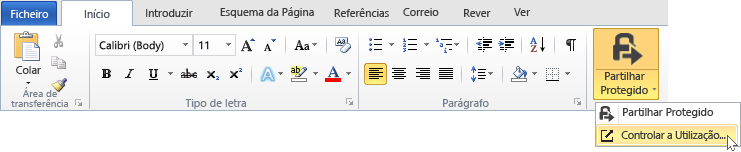
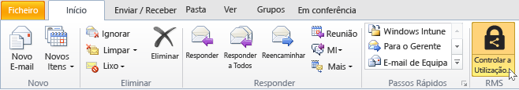
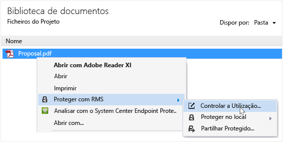
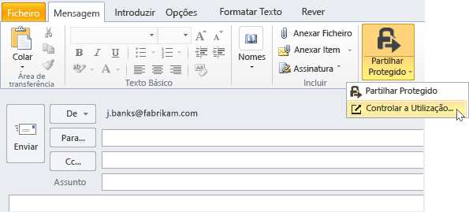

# Monitorizar e revogar os seus documentos ao utilizar a aplica&#231;&#227;o de partilha RMS
Após ter protegido os documentos utilizando a aplicação de partilha RMS, se a sua organização utilizar o Azure Rights Management, em vez de serviços de gestão de direitos do Active Directory, pode controlar a forma como as pessoas a utilizarem os documentos protegidos. Se necessário, também pode revogar o acesso a estes documentos quando pretender parar de partilhá-los. Para tal, utilize o **documento controlo do site**, que pode aceder a partir de computadores Windows, computadores Mac e até mesmo a partir de telemóveis e tablets.

> [!TIP]
> Vídeo de dois minutos: [Controlo de documento do Azure RMS e de revogação.](http://channel9.msdn.com/Series/Information-Protection/Azure-RMS-Document-Tracking-and-Revocation)

Ao aceder a este site, inicie sessão para controlar os seus documentos. Fornecer a sua organização tiver um [subscrição que suporta o controlo de documento e revogação](https://technet.microsoft.com/dn858608.aspx) e lhe foi atribuída uma licença para esta subscrição, em seguida, pode ver quem tentou abrir os ficheiros que protegeu e se o fizeram com êxito (se foram autenticados com êxito) ou não. Cada vez que tentaram aceder o documentos e a respetiva localização no momento. Além disso:

-   Se precisar de parar de partilhar um documento: Clique em **revogar o acesso**, tenha em atenção o período de tempo que o documento continuará a estar disponíveis e decidir se pretende que saibam que está a revogar acesso ao documento previamente partilhado e fornece uma mensagem personalizada.

-   Se pretender exportar para o Excel: Clique em **Abrir no Excel**, para que, em seguida, pode modificar os dados e criar as suas próprias vistas e gráficos.

-   Se pretender configurar notificações por e-mail: Clique em **definições** e selecione como e se deve ser enviado por correio eletrónico quando o documento seja acedido.

-   Se tiver dúvidas ou pretender fornecer comentários sobre o documento de controlo do site: Clique no ícone de ajuda para aceder a [Perguntas mais frequentes para controlar o documento](http://go.microsoft.com/fwlink/?LinkId=523977).

## Utilizar o Office para aceder ao site de monotorização de documentos

-   Para o Office aplicações, Word, Excel e PowerPoint: No **base** separador o **RMS** grupo, clique em **partilhar protegido**, e, em seguida, clique em **controlar a utilização**.

    

-   Para o Outlook: No **base** separador o  **RMS** grupo, clique em **controlar a utilização**:

    

Se não vir estas opções de RMS, é provável que a aplicação de partilha RMS não está instalada no seu computador, a versão mais recente não esteja instalada, ou que o computador tem de ser reiniciado para concluir a instalação. Para obter mais informações sobre como instalar a aplicação de partilha, consulte o artigo [Transferir e instalar a aplicação de partilha Rights Management](../Topic/Download_and_install_the_Rights_Management_sharing_application.md).

### Outras formas de monitorizar e revogar os seus documentos
Para além de controlar os seus documentos em computadores Windows através da utilização de aplicações do Office, também pode utilizar estes alternativas:

-   **Utilizando um web browser**: Este método funciona para todos os dispositivos suportados.

-   **Utilizando o Explorador de ficheiros**: Este método funciona para computadores Windows.

-   **Utilizar uma mensagem de correio eletrónico do Outlook**: Este método funciona para computadores Windows.

##### Utilizar um browser para aceder ao site de controlo do documento

-   Utilizando um browser suportado, vá para o [documento controlo do site](http://go.microsoft.com/fwlink/?LinkId=529562).

    Browsers suportados: É recomendável utilizar o Internet Explorer que é, pelo menos, versão 10, mas pode utilizar qualquer um dos seguintes browsers para utilizar o site de monotorização de documentos:

    -   Internet Explorer: Pelo menos versão 10

    -   Internet Explorer 9 com a MS12-037: Atualização de segurança cumulativa para o Internet Explorer: 12 de Junho de 2012

    -   Mozilla Firefox: Pelo menos versão 12

    -   Apple Safari 5: Pelo menos versão 5

    -   Google Chrome: Pelo menos versão 18

##### Utilizar o Explorador de ficheiros para aceder o sites de monotorização de documentos

-   Com o botão direito no ficheiro, selecione **proteger com RMS**, e, em seguida, selecione **controlar a utilização**:

    

##### Utilizar uma mensagem de e-mail do Outlook para aceder ao site de controlo do documento

-   Numa mensagem de correio eletrónico, no **mensagem** separador o  **RMS** grupo, clique em **partilhar protegido**, e, em seguida, clique em **controlar a utilização**:

    

## Exemplos e outras instruções
Para obter exemplos de como pode utilizar a aplicação e instruções sobre como proceder de partilha Rights Management, consulte as secções seguintes a partir do Guia do utilizador aplicação partilha Rights Management:

-   [Exemplos para utilizar a aplicação de partilha RMS](../Topic/Rights_Management_sharing_application_user_guide.md#BKMK_SharingExamples)

-   [O que pretende fazer?](../Topic/Rights_Management_sharing_application_user_guide.md#BKMK_SharingInstructions)

## Consultar Também
[Guia de utilizador de aplicação partilha do Rights Management](../Topic/Rights_Management_sharing_application_user_guide.md)

