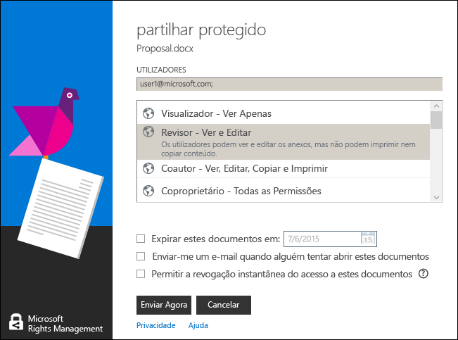

# Utilizar atalhos de teclado na aplica&#231;&#227;o de partilha Rights Management
Quando utilizar a aplicação de partilha RMS, prima a **Alt** chave para ver as teclas de acesso disponíveis e, em seguida, prima **Alt** + a tecla de acesso para selecionar uma opção.

Por exemplo, no **partilha protegida** caixa de diálogo, prima **Alt** para ver as teclas de acesso e, em seguida, prima **Alt + m** para selecionar o **E-Mail-me quando alguém tentar abrir estes documentos** caixa de verificação.

## Exemplos e outras instruções
Para obter exemplos de como pode utilizar a aplicação e instruções sobre como proceder de partilha Rights Management, consulte as secções seguintes a partir do Guia do utilizador aplicação partilha Rights Management:

-   [Exemplos para utilizar a aplicação de partilha RMS](../Topic/Rights_Management_sharing_application_user_guide.md#BKMK_SharingExamples)

-   [O que pretende fazer?](../Topic/Rights_Management_sharing_application_user_guide.md#BKMK_SharingInstructions)

## Consultar Também
[Guia de utilizador de aplicação partilha do Rights Management](../Topic/Rights_Management_sharing_application_user_guide.md)

