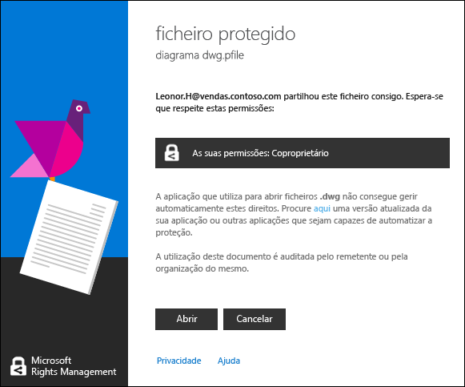

# Ver e utilizar ficheiros que foram protegidos por Rights Management
Quando o [Rights Management (RMS) a aplicação de partilha está instalado no seu computador](https://technet.microsoft.com/library/dn574734%28v=ws.10%29.aspx), ver um ficheiro protegido por um duplo clique. O ficheiro pode ser um anexo numa mensagem de e-mail ou poderá vê-lo ao utilizar o Explorador de ficheiros.

> [!NOTE]
> Antes de poder visualizar o ficheiro protegido, RMS tem primeiro de confirmar que está autorizado a ver o ficheiro, o que faz verificando o seu nome de utilizador e palavra-passe. Em alguns casos, isto poderá estar em cache e não verá uma linha de comandos que lhe pede para as suas credenciais. Noutros casos, será solicitado que forneça as credenciais.
> 
> Se a sua organização não utilizar o Azure Rights Management (RMS do Azure) nem o AD RMS, pode aplicar uma conta gratuita que aceitará as credenciais para que pode abrir ficheiros que estão protegidos utilizando o RMS:
> 
> -   Para aplicar para esta conta, clique na ligação para aplicar para [RMS para indivíduos](http://go.microsoft.com/fwlink/?LinkId=309469).
> 
>     Quando se inscreve, utilize o seu endereço de e-mail da empresa em vez de um endereço de e-mail pessoal. Caso esteja a inscrever porque recebeu um anexo protegido, utilize o mesmo endereço de e-mail que foi utilizado para enviar a mensagem de e-mail.
> -   Para obter mais informações, consulte o artigo [RMS para indivíduos e gestão de direitos do Windows Azure](http://technet.microsoft.com/library/dn592127.aspx).

## Para ver um ficheiro protegido
Ao utilizar o Explorador de ficheiros ou a mensagem de correio eletrónico que contém o anexo, faça duplo clique no ficheiro protegido e introduza as suas credenciais, se lhe for pedido para fazê-lo.

Se vir duas versões do ficheiro, mas com extensões de nome de ficheiro diferente, abra o ficheiro que tem uma extensão de ficheiro. ppdf apenas se o outro ficheiro não abrir. Se optar por não é possível abrir a versão. ppdf, primeiro de instalar o [aplicação de partilha RMS](http://technet.microsoft.com/library/dn574734.aspx), que sabe como abrir ficheiros que tenham uma extensão de nome de ficheiro. ppdf.

> [!NOTE]
> Para obter mais informações, consulte "[O que é o ficheiro. ppdf criado automaticamente?](../Topic/Dialog_box_options_for_the_Rights_Management_sharing_application.md#BKMK_PPDF)".

Como o ficheiro abre depende de como foi protegido, que pode confirmar observando a extensão de nome de ficheiro. Cada caso, abrir o ficheiro pode ser auditado e permanece auditado desde que esteja protegido. Além disso, se o ficheiro foi enviado como anexo de correio eletrónico, o remetente poderá ser notificado por correio eletrónico sempre que abre o ficheiro.

|Extensão de nome de ficheiro e proteção|Obter mais informações|
|-------------------------------------------|--------------------------|
|O ficheiro tem um **. pfile** extensão de nome de ficheiro.  O ficheiro foi protegido genericamente.|Quando abrir o ficheiro, verá um **ficheiro protegido** caixa de diálogo a partir da aplicação de partilha que indica quem protegeu o ficheiro e que é esperado que respeite as permissões de coproprietário. Clique em **Abrir** para ler o ficheiro.  |
|O ficheiro tem um **. ppdf** extensão de nome de ficheiro ou é um ficheiro de texto ou de imagem protegido (tais como **. ptxt** ou **. pjpg**).  O ficheiro foi protegido nativamente como uma cópia só de leitura.|O ficheiro abre utilizando o Visualizador que instala com a aplicação de partilha RMS. Este ficheiro é só de leitura, mesmo se guardá-lo para outra localização ou mude o nome.|
|Outras extensões de nome de ficheiro.  O ficheiro foi protegido nativamente.|O ficheiro abre utilizando a aplicação que está associada a extensão de nome de ficheiro original e uma faixa de restrição é apresentada na parte superior do ficheiro. A faixa pode mostrar as permissões que são aplicadas ao ficheiro, ou pode disponibilizar uma ligação para mostrá-las. Por exemplo, poderá ver o seguinte em que tem de clicar em **permissão está atualmente restrita** para ver as permissões reais que são aplicadas ao ficheiro e as pessoas que consegue aceder-lhe:  |
Para obter uma lista completa das extensões de nome de ficheiro que Rights Management suporta, consulte o [Tipos de ficheiro suportados e extensões de nome de ficheiro](../Topic/Rights_Management_sharing_application_administrator_guide.md#BKMK_SupportFileTypes) secções a  [Guia partilha Rights Management aplicação administrador](../Topic/Rights_Management_sharing_application_administrator_guide.md). Se a extensão de nome de ficheiro não estiver listado, utilize uma pesquisa web para ver se é uma extensão de nome de ficheiro que é suportada por outra aplicação.

> [!NOTE]
> Se, depois de confirmar que o ficheiro está protegido por Rights Management e o ficheiro não abre, transferir e utilizar o [ferramenta Analisador de RMS](https://www.microsoft.com/en-us/download/details.aspx?id=46437). Siga as instruções na ferramenta para verificar a existência de problemas no seu computador que poderá impedir que um documento protegido abertura.

## Para utilizar ficheiros que foram protegidos (por exemplo, editar e imprimir o ficheiro)
Se, depois de abrir o ficheiro protegido, que pretende mais do que apenas lê-la (por exemplo, editar, copiar e imprimi-lo):

|Extensão de nome de ficheiro|Instruções|
|--------------------------------|--------------|
|O ficheiro tem um **. pfile** extensão de nome de ficheiro.|Guarde o ficheiro aberto e conceda-lhe uma nova extensão de nome de ficheiro que esteja associada com a aplicação que pretende utilizar.  Por exemplo, se um ficheiro foi protegido utilizando o nome de ficheiro documento.vsdx.pfile, visualize o ficheiro e no Explorador de ficheiros, guarde o ficheiro como vsdx.  O novo ficheiro já não está protegido. Se pretender protegê-lo, tem de fazer isto manualmente. Para obter instruções, consulte o artigo [Proteger um ficheiro num dispositivo &#40;proteger no local&#41; utilizando a aplicação de partilha Rights Management](../Topic/Protect_a_file_on_a_device__protect_in-place__by_using_the_Rights_Management_sharing_application.md).|
|O ficheiro tem um **. ppdf** extensão de nome de ficheiro ou é um ficheiro de texto ou de imagem protegido (tais como **. ptxt** ou **. pjpg**).|Só pode visualizar o ficheiro e se mudar o nome ou movê-lo, a proteção permanece com o ficheiro.|
|Outras extensões de nome de ficheiro.|O dispositivo tem de ter uma aplicação que suporte o Rights Management para utilizar estes ficheiros. Estas aplicações chamam-se aplicações suportadas por RMS. As aplicações do Office 2016, Office 2013 e Office 2010 (como o Word, Excel, PowerPoint e Outlook) são exemplos de aplicações que são suportadas por Rights Management. Mas as aplicações que não são da Microsoft, tais como outras empresas de software e as suas próprias aplicações de linha de negócio, poderão também ser suportadas por Rights Management.  Aplicações suportadas por aplicações que são suportadas por Rights Management conseguem abrir ficheiros que foram protegidos por outros Rights Management. Também mantêm a proteção que lhes foi aplicada, mesmo se editar o ficheiro ou guardá-lo para outro nome de ficheiro ou noutra localização. Estas aplicações permitem-lhe utilizar o ficheiro de acordo com as permissões aplicadas atualmente ao ficheiro, para que se tiver permissões para utilizar o ficheiro, pode fazê-lo. Por exemplo, poderá editar o ficheiro, mas não imprimi-lo.|

## Exemplos e outras instruções
Para obter exemplos de como pode utilizar a aplicação e instruções sobre como proceder de partilha Rights Management, consulte as secções seguintes a partir do Guia do utilizador aplicação partilha Rights Management:

-   [Exemplos para utilizar a aplicação de partilha RMS](../Topic/Rights_Management_sharing_application_user_guide.md#BKMK_SharingExamples)

-   [O que pretende fazer?](../Topic/Rights_Management_sharing_application_user_guide.md#BKMK_SharingInstructions)

## Consultar Também
[Guia de utilizador de aplicação partilha do Rights Management](../Topic/Rights_Management_sharing_application_user_guide.md)

