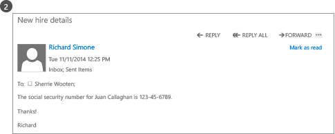
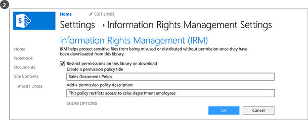
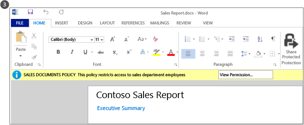
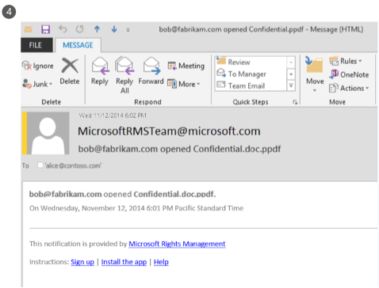
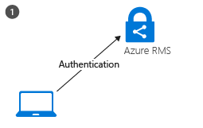
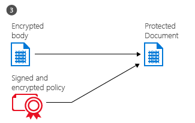

# O que &#233; o Azure Rights Management?
Azure Rights Management (RMS do Azure) é uma solução de proteção de informações para as organizações que pretendem proteger os seus dados no ambiente de trabalho de um desafio de hoje.

Estes desafios incluem a necessidade de estar ligado à Internet com utilizadores levem dispositivo pessoal para o seu trabalho, aceder aos dados da empresa de estrada e de casa e partilhar informações confidenciais com parceiros de negócio importantes. Como parte do seu trabalho diário, os utilizadores partilham informações através de e-mail, sites de partilha de ficheiros e serviços em nuvem. Nestes cenários, controlos de segurança tradicional (tais como listas de controlo de acesso e permissões de NTFS) e as firewalls têm limitada eficácia se pretender proteger os dados da sua empresa, ainda permitindo aos seus utilizadores para trabalhar de forma eficaz.

Em comparação, o Azure RMS pode proteger informações confidenciais da sua empresa em todos os estes cenários. Utiliza encriptação, de identidade e de políticas de autorização para ajudar a proteger os seus ficheiros e o e-mail e funciona em vários dispositivos — telemóveis, tablets e PCs. Informações podem ser protegidas dentro da sua organização e fora da sua organização, porque essa proteção permanece com os dados, mesmo quando deixa-limites da sua organização. Por exemplo, os funcionários poderão enviar por e-mail um documento a uma empresa parceira ou guardam um documento a respetiva unidade de nuvem. A proteção persistente que fornece o Azure RMS não só ajuda a proteger os dados da sua empresa, mas também poderá ser exigida dentro de conformidade, requisitos de deteção jurídica ou práticas de gestão de informações simplesmente bom.

Mas muito importante, as pessoas autorizadas e serviços (por exemplo, pesquisa e indexação) poderá continuar a ler e inspecionar os dados que protege o Azure RMS, que não são realizados facilmente com outras soluções de proteção de informações que utilizam encriptação-to-peer. Esta capacidade é por vezes referida como "reasoning através de dados" e é um elemento fundamental mantém o controlo de dados da sua organização.

A imagem seguinte mostra como Azure RMS funciona como uma solução de gestão de direitos para o Office 365, bem como a servidores no local e serviços. Também verá que suporta os dispositivos do utilizador final populares que executam o Windows, sistema operativo Mac, iOS, Android e Windows Phone.

> [!TIP]
> Neste momento, poderá ser útil os recursos adicionais:
> 
> -   Vídeo de dois minutos: [O que é o Microsoft Azure Rights Management](http://technet.microsoft.com/dn833005.aspx)
> -   Tutorial cinco passos: [Tutorial guia de introdução para o Azure Rights Management](../Topic/Quick_Start_Tutorial_for_Azure_Rights_Management.md)
> -   Azure RMS os requisitos, incluindo as opções de subscrição para comprar ou avaliar: [Requisitos para o Azure Rights Management](../Topic/Requirements_for_Azure_Rights_Management.md)

Utilize as secções seguintes para obter mais informações sobre o Azure RMS:

-   [Que problemas resolver pelo Azure RMS?](../Topic/What_is_Azure_Rights_Management_.md#BKMK_RMSrequirements)

    -   [Os requisitos de regulamentação, conformidade e segurança](../Topic/What_is_Azure_Rights_Management_.md#BKMK_RMScompliance)

-   [Azure RMS em ação: O que os utilizadores e administradores visualizam](../Topic/What_is_Azure_Rights_Management_.md#BKMK_RMSpictures)

    -   [Ativar e configurar a gestão de direitos](../Topic/What_is_Azure_Rights_Management_.md#BKMK_Example_ManagementPortal)

    -   [Proteger automaticamente os ficheiros em servidores de ficheiros a executar o Windows Server e a infraestrutura de classificação de ficheiros](../Topic/What_is_Azure_Rights_Management_.md#BKMK_Example_FCI)

    -   [Proteger automaticamente a mensagens de correio eletrónico com o Exchange Online e as políticas de prevenção de perda de dados](../Topic/What_is_Azure_Rights_Management_.md#BKMK_Example_DLP)

    -   [Proteger automaticamente os ficheiros com o SharePoint Online e de bibliotecas protegidas](../Topic/What_is_Azure_Rights_Management_.md#BKMK_Example_SharePoint)

    -   [Os utilizadores partilham de forma segura anexos com utilizadores móveis](../Topic/What_is_Azure_Rights_Management_.md#BKMK_Example_SharingApp)

-   [Como é que o Azure RMS é funciona? Em definições avançadas](../Topic/What_is_Azure_Rights_Management_.md#BKMK_HowRMSworks)

    -   [Controlos de criptografia utilizados pelo Azure RMS: Comprimentos de chaves e algoritmos](../Topic/What_is_Azure_Rights_Management_.md#BKMK_RMScrytographics)

    -   [Instruções de como funciona o Azure RMS: Utilizar pela primeira vez, a proteção, o consumo de conteúdo de conteúdo](../Topic/What_is_Azure_Rights_Management_.md#BKMK_Walthrough)

-   [Próximos passos](../Topic/What_is_Azure_Rights_Management_.md#BKMK_NextSteps)

## Que problemas resolver pelo Azure RMS?
Utilize a tabela seguinte para identificar necessidades comerciais ou problemas que poderá ter a sua organização e como o Azure RMS pode resolver estas.

|Requisito ou problema|Resolvido pelo Azure RMS|
|-------------------------|----------------------------|
|Proteger todos os tipos de ficheiro|√ Na implementação anterior do Rights Management, Office só foi possível proteger ficheiros, utilizar a proteção nativa. Agora, [proteção genérica](https://technet.microsoft.com/library/dn574738%28v=ws.10%29.aspx) significa que todos os tipos de ficheiro são suportados.|
|Proteger ficheiros em qualquer lugar|√ Quando um ficheiro é guardado para uma localização ([proteger no local](https://technet.microsoft.com/library/dn574733%28v=ws.10%29.aspx)), a proteção permanece com o ficheiro, mesmo que é copiado para o armazenamento que não está sob o controlo de IT, tal como um serviço de armazenamento em nuvem.|
|Partilhar ficheiros de forma segura por e-mail|√ Quando um ficheiro é partilhado por correio eletrónico ([partilha protegida](https://technet.microsoft.com/library/dn574735%28v=ws.10%29.aspx)), o ficheiro está protegido como um anexo a uma mensagem de correio eletrónico, com instruções como abrir o anexo protegido. O texto do correio eletrónico não é encriptado, pelo que o destinatário pode sempre Leia estas instruções. No entanto, uma vez que o documento anexado estiver protegido, apenas utilizadores autorizados possam será possível abri-lo, mesmo que o correio eletrónico ou um documento é reencaminhado para outras pessoas.|
|Auditoria e monitorização|√ Pode [auditar e monitorizar a utilização de](https://technet.microsoft.com/library/dn529121.aspx) dos ficheiros protegidos, mesmo depois destes ficheiros deixe limites da sua organização.  Por exemplo, é funciona para Contoso, Ltd. Estiver a trabalhar num projeto joint com 3 pessoas da Fabrikam, Inc. Enviar por e-mail estas 3 pessoas um documento que proteger e restringir só de leitura. A auditoria do Azure RMS, pode fornecer as seguintes informações:  -   Se as pessoas que especificou na Fabrikam abriu o documento e quando. -   Se outras pessoas que não especificou uma tentativa (e falha) para abrir o documento, talvez porque foi reencaminhado ou guardada para uma localização partilhada que podem aceder a outros utilizadores. -   Se qualquer uma das pessoas especificadas tentou (e falha) para imprimir ou alterar o documento.|
|Suporte para todos os utilizados mais frequentemente dispositivos, não apenas computadores com o Windows|√ [dispositivos suportados](https://technet.microsoft.com/library/dn655136.aspx) incluem:  -   Computadores com o Windows e telemóveis -   Computadores Mac -   telemóveis e iOS tablets -   Telemóveis e tablets com Android|
|Suporte para colaboração de negócio para empresas|√ Porque o Azure RMS é um serviço em nuvem, não é necessário configurar explicitamente confianças com outras organizações antes de poder partilhar conteúdo protegido com elas. Se já tiver do Office 365 ou um diretório do Azure AD, colaboração em organizações automaticamente é suportada. Se não tiverem, os utilizadores podem inscrever-se gratuita [RMS para indivíduos](https://technet.microsoft.com/library/dn592127.aspx) subscrição.|
|Suporte para serviços no local, bem como o Office 365|√ Para além de trabalhar [forma totalmente integrada com o Office 365](https://technet.microsoft.com/library/jj585004.aspx), pode também utilizar o Azure RMS com os seguintes serviços no local ao implementar o [conector RMS](https://technet.microsoft.com/library/dn375964.aspx):  -   Exchange Server -   Servidor do SharePoint -   Windows Server com a infraestrutura de classificação de ficheiros|
|Ativação fácil|√ [ativação do serviço de gestão de direitos](https://technet.microsoft.com/library/jj658941.aspx) para os utilizadores requer apenas alguns cliques no portal do Azure clássico.|
|Capacidade para dimensionar na sua organização, conforme necessário|√ Porque o Azure RMS é executado como um serviço em nuvem com a Azure elasticidade dimensionar e saída de cópia de segurança, não terá de aprovisionar ou implementar adicionais servidores no local.|
|Capacidade para criar políticas simples e flexíveis|√ [personalizado modelos de política de direitos](https://technet.microsoft.com/library/dn642472.aspx) fornecem uma solução rápida e fácil para os administradores aplicar as políticas e para os utilizadores aplicar o nível correto de proteção para cada documento e restringir o acesso a pessoas da sua organização.  Por exemplo, para um documento de estratégia de toda a empresa irá ser partilhado com todos os funcionários, pode aplicar uma política de só de leitura a todos os empregados internos. Em seguida, para um documento mais confidencial, tais como um relatório financeiro, pode restringir o acesso a executivos apenas.|
|Suporte de aplicações abrangentes|√ Azure RMS tem integração justa com aplicações do Microsoft Office e serviços e expande o suporte para outras aplicações ao utilizar a aplicação de partilha RMS.  √ o   [SDK de gestão de direitos do Microsoft](https://msdn.microsoft.com/library/hh552972%28v=vs.85%29.aspx) fornece os programadores internos e fornecedores de software com APIs para escrever aplicações personalizadas que suportam o Azure RMS.  Para obter mais informações, consulte o artigo [Como as aplicações suportam gestão de direitos do Azure](../Topic/How_Applications_Support_Azure_Rights_Management.md).|
|IT têm de manter o controlo de dados|√ Organizações optar por gerir os seus próprios chave do inquilino e utilizar o "[colocar o seu próprio chave](https://technet.microsoft.com/library/dn440580.aspx)" solução (BYOK) e armazenar as respetivas chaves de inquilino de módulos de segurança de Hardware (HSMs).  √ Suporte para auditoria e [registo utilização](https://technet.microsoft.com/library/dn529121.aspx) para que possa analisar para informações empresariais, monitorizar abuso, e (se tiver uma fuga de informação) efetuar análise forense.  √ Delegados acesso utilizando o [funcionalidade de utilizador super](https://technet.microsoft.com/library/mt147272.aspx) assegura que TI podem sempre acesso protegidos conteúdo, mesmo se um documento tiver sido protegido por um empregado que, em seguida, deixe a organização. Em comparação, acesso perder do risco de soluções de encriptação-to-peer aos dados da empresa.  √ Sincronizar [apenas os atributos do diretório que precisa do Azure RMS](https://azure.microsoft.com/documentation/articles/active-directory-aadconnectsync-attributes-synchronized/) para suportar uma identidade comum para as contas do Active Directory no local, utilizando um [ferramenta de sincronização de diretórios](https://azure.microsoft.com/documentation/articles/active-directory-aadconnect-get-started-tools-comparison/), tais como o Azure AD Connect.  √ Ative o início de sessão único sem replicar as palavras-passe para a nuvem, utilizando em AD FS.  √ Organizações têm sempre a opção para parar de utilizar o Azure RMS sem perder o acesso a conteúdo que foi anteriormente protegido pelo Azure RMS. Para obter informações sobre a desativação de opções, consulte o artigo [Desativação e a desativação do Azure Rights Management](../Topic/Decommissioning_and_Deactivating_Azure_Rights_Management.md). Além disso, as organizações que implementaram Active Directory Rights Management Services (AD RMS) podem [Migrar para o Azure RMS](https://technet.microsoft.com/library/dn858447.aspx) sem perder acesso aos dados que foi anteriormente protegido pelo AD RMS.|
> [!TIP]
> Se estiver familiarizado com a versão no local do Rights Management, Active Directory Rights Management Services (AD RMS), poderá estar interessado na tabela de comparação de [Comparar o Azure Rights Management e o AD RMS](../Topic/Comparing_Azure_Rights_Management_and_AD_RMS.md).

### Os requisitos de regulamentação, conformidade e segurança
Azure RMS suporta os seguinte segurança, conformidade e os requisitos de regulamentação:

√ Utilização de criptografia de norma da indústria e suporta a certificação FIPS 140-2. Para obter mais informações, consulte o [Controlos de criptografia utilizados pelo Azure RMS: Comprimentos de chaves e algoritmos](../Topic/What_is_Azure_Rights_Management_.md#BKMK_RMScrytographics) deste tópico.

√ os centros de suporte de módulos de segurança de Hardware do Thales (HSMs) para armazenar a chave de inquilino nos dados do Microsoft Azure. Azure RMS utiliza mundo de segurança para os respetivos centros de dados na América do Norte, EMEA (Europa, Médio Oriente e África) e na Ásia, por isso, as chaves podem ser utilizadas apenas na sua região.

√ Certificados para o seguinte:

-   ISO/IEC 27001:2013 (inclui [norma ISO/IEC 27018](http://azure.microsoft.com/blog/2015/02/16/azure-first-cloud-computing-platform-to-conform-to-isoiec-27018-only-international-set-of-privacy-controls-in-the-cloud/))

-   Attestations SOC 2 SSAE 16/ISAE 3402

-   HIPAA BAA

-   Modelo de UE cláusula

-   FedRAMP como parte do Azure Active Directory no Office 365 certificação, emitido FedRAMP Agência autoridade para Operate por HHS

-   Nível de PCI DSS 1

Para mais informações sobre estes certificados externos, consulte o [Centro de fidedignidade do Azure](http://azure.microsoft.com/support/trust-center/compliance/).

## Azure RMS em ação: O que os utilizadores e administradores visualizam
As imagens nesta secção mostram alguns exemplos típicos de administradores e utilizadores ver e podem utilizar o Azure RMS para o ajudar a proteger as informações confidenciais.

> [!NOTE]
> Todos estes exemplos onde o Azure RMS protege os dados, o proprietário do conteúdo continua a ter acesso total aos dados (ficheiro ou correio eletrónico), mesmo que a proteção aplicada concede permissões a um grupo de que o proprietário não foi um membro de, ou mesmo que a proteção aplicada inclui uma data de expiração.
> 
> Da mesma forma, TI podem aceder sempre os dados protegidos sem restrições, utilizando a funcionalidade de utilizador super do Rights Management que concede acesso delegado para os utilizadores autorizados ou serviços que especificou. Além disso, TI podem controlar e monitorizar a utilização de dados que foi protegidos — por exemplo, que está a aceder os dados e quando.

Para outros capturas de ecrã e vídeos que apresentam o RMS em ação, verifique o [portal de serviços Microsoft Rights Management](http://www.microsoft.com/rms), a [blogue da equipa do Microsoft Rights Management (RMS)](http://blogs.technet.com/b/rms), e [organizada conteúdo para o Azure RMS no Curah! site](http://curah.microsoft.com/Search?query="Azure%20RMS").

### Ativar e configurar a gestão de direitos
Apesar de poder utilizar o Windows PowerShell para ativar e configurar o Azure RMS, é mais fácil a partir do portal de gestão. Assim que o serviço está ativado, tiver dois modelos predefinidos que os administradores e os utilizadores podem selecionar a forma rápida e facilmente aplicar proteção de informações a ficheiros. Mas também pode criar os seus modelos personalizados e definições de opções adicionais.

|||
|-|-|
|  [Maior imagem](http://technet.microsoft.com/98d53a12-3b19-4622-bb1e-75ef56df5438) (por predefinição, na mesma janela do browser)|Pode utilizar o Centro de administração do Office 365 (primeiro imagem) ou o portal do Azure clássico (imagem segunda) para ativar RMS.  Um único clique para ativar e clique em outro para confirmar, em seguida, a proteção de informação está ativada para os administradores e utilizadores na sua organização.|
|  [Maior imagem](http://technet.microsoft.com/596e4fec-124c-41b1-8efd-63d5179193fb) (por predefinição, na mesma janela do browser)|Após a ativação, modelos de política de direitos de dois estão automaticamente disponíveis para a sua organização. Um modelo de destina-se só de leitura (**apenas visualização confidencial** está incluído no nome), outro para ler e modificar acesso (**Confidencial**).  Quando estes modelos são aplicados a ficheiros ou mensagens de correio eletrónico, podem restringir o acesso aos utilizadores na sua organização. Esta é uma forma muito rápida e fácil para ajudar a evitar dados da sua empresa leaking às pessoas fora da sua organização. **Tip:** Pode reconhecer facilmente estes modelos predefinidos, uma vez que são automaticamente adicionado como prefixo pela sua organização nome. No nosso exemplo, **VanArsdel, Lda.**. Se não pretender que os utilizadores vejam estes modelos, ou se pretender criar os seus próprios modelos, pode fazê-lo a partir do portal do Azure clássico. Como esta imagem mostra, um assistente orienta-o processo de criação de modelo personalizado.|
|  [Maior imagem](http://technet.microsoft.com/f5df80e5-efc9-4c0f-91be-060225977356) (por predefinição, na mesma janela do browser)|Acesso offline, definições de validade e se pretende publicar o modelo imediatamente (torná-lo visível em aplicações que suportem gestão de direitos) são algumas das definições de configuração disponíveis se optar por criar os seus próprios modelos.|
|  [Maior imagem](http://technet.microsoft.com/597a3402-fd5a-4bcf-b5e6-5c983dbde697) (por predefinição, na mesma janela do browser)|Como resultado de publicação estes modelos, os utilizadores agora podem selecioná-los em aplicações como o Explorador de ficheiros e o Microsoft Word:  -   Um utilizador pode escolher o modelo predefinido, **VanArsdel, Lda. – confidencial**. Em seguida, apenas os funcionários da organização VanArsdel podem abrir e utilizar este documento, mesmo que tenha mais tarde enviados por e-mail para alguém fora da organização ou guardado numa localização pública. -   Um utilizador pode escolher o modelo personalizado que criou o administrador, **vendas e Marketing – leitura e imprimir apenas**. Em seguida, não apenas o ficheiro está protegido de pessoas fora da organização, mas também restringido aos funcionários de vendas e o departamento de Marketing. Ainda mais, estes funcionários não ter direitos completos para o documento, só de leitura e imprimir. Por exemplo, não é possível modificá-lo ou copiar a partir do mesmo.|
Para obter mais informações, consulte o artigo [Ativar o Azure Rights Management](../Topic/Activating_Azure_Rights_Management.md) e [Configurar modelos personalizados para o Azure Rights Management](../Topic/Configuring_Custom_Templates_for_Azure_Rights_Management.md).

Para ajudar os utilizadores a proteger os ficheiros importantes da empresa, consulte o artigo [Ajudar os utilizadores a proteger ficheiros utilizando o Azure Rights Management](../Topic/Helping_Users_to_Protect_Files_by_Using_Azure_Rights_Management.md).

Em seguida, veja alguns exemplos de como os administradores podem aplicar modelos para configurar automaticamente a proteção de informações de ficheiros e mensagens de correio eletrónico.

### Proteger automaticamente os ficheiros em servidores de ficheiros a executar o Windows Server e a infraestrutura de classificação de ficheiros
Este exemplo mostra como pode utilizar o Azure RMS para proteger automaticamente os ficheiros em servidores de ficheiros que executem, pelo menos, Windows Server 2012 e estão configurados para utilizar a infraestrutura de classificação de ficheiros.

Existem várias formas de aplicar os valores de classificação para ficheiros. Por exemplo, pode inspecionar os conteúdos dos ficheiros e em conformidade aplicar classificações incorporadas, tais como confidencialidade e informação identificativa. No entanto, neste exemplo, um administrador cria uma classificação personalizada de **Marketing** que é aplicada automaticamente a todos os documentos de utilizador que são guardados no **promoções Marketing** pasta. Embora esta pasta está protegida com permissões de NTFS que restringe o acesso aos membros do grupo de Marketing, o administrador sabe que estas permissões podem ser perdidas se alguém desse grupo move o cursor ou e-mails os ficheiros. Em seguida, as informações nos ficheiros do podem ser acedidas por utilizadores não autorizados.

|||
|-|-|
|  [Maior imagem](http://technet.microsoft.com/cf18c56b-c301-4640-8d9e-9e677e494091) (por predefinição, na mesma janela do browser)|Os administradores instala e configura o conector de gestão de direitos (RMS), que é funciona como um reencaminhamento entre servidores no local e o Azure RMS.|
|  [Maior imagem](http://technet.microsoft.com/ba3e247d-ea5e-4009-8eac-74f70270ece0) (por predefinição, na mesma janela do browser)|No servidor de ficheiros, o administrador configura as regras de classificação e tarefas, para que todos os ficheiros de utilizador no **promoções Marketing** pasta são automaticamente classificados como **Marketing** e protegido com encriptação do RMS.  Seleciona o modelo personalizado do RMS que foi criado no nosso exemplo primeiro, o que restringe o acesso aos membros das vendas e Marketing departamentos: **Vendas e Marketing – ler e imprimir apenas**.  Como resultado, todos os documentos nessa pasta são automaticamente configurados com a classificação de Marketing e protegidos pela vendas e Marketing RMS modelo.|
|  [Maior imagem](http://technet.microsoft.com/ad666594-68df-4289-835a-235b2af9bf4b) (por predefinição, na mesma janela do browser)|Como o RMS ajuda a impedir que os dados leaking às pessoas que não devem ter acesso a informações confidenciais:  -   Janet, a partir de Marketing, e-mails um relatório a partir da pasta promoções Marketing confidencial. Este relatório contém novas funcionalidades do produto e planos de publicidade e é pedido por um colega de trabalho que está atualmente a viajar no negócio. No entanto, Janet por engano e-mails-lo à pessoa errada — ela não tenha em atenção que ela acidentalmente selecionado um destinatário com um nome semelhante, de outra empresa.     O destinatário não é possível ler o relatório confidencial porque ele não é um membro de vendas e o grupo de Marketing.|
Para obter mais informações, consulte o artigo [Implementar o conector de gestão de direitos do Azure](../Topic/Deploying_the_Azure_Rights_Management_Connector.md).

### Proteger automaticamente a mensagens de correio eletrónico com o Exchange Online e as políticas de prevenção de perda de dados
O exemplo anterior mostrou como pode proteger automaticamente ficheiros que contêm informações confidenciais, mas e se as informações são não num ficheiro, mas numa mensagem de e-mail? Este é onde Exchange Online políticas de prevenção (DLP) de perda de dados entra em ação, a pedir aos utilizadores para aplicar a proteção de informações (utilizando sugestões de política) ou automaticamente se candidatá-lo-las (utilizando regras de transporte).

Neste exemplo, o administrador configura uma política para ajudar a manter a organização em conformidade com normas para proteger os dados de informação identificativa-nos, mas as regras também podem ser configuradas para outros normas de conformidade ou regras personalizadas que definir.

|||
|-|-|
|  [Maior imagem](http://technet.microsoft.com/58461319-3981-4b7f-a195-956a1778e907) (por predefinição, na mesma janela do browser)|O modelo do Exchange com o nome **EUA Dados pessoalmente identificáveis informações (PII)** é utilizado pelo administrador para criar e configurar uma nova política DLP. Este modelo de procura de informações, tais como números da segurança social e os números de licença de controlador nas mensagens de correio eletrónico.  As regras são configuradas para que as mensagens de correio eletrónico que contêm estas informações e que são enviadas para fora da organização automaticamente têm a proteção de direitos aplicada utilizando um modelo de RMS que restringe o acesso a apenas a empregados da empresa.  Aqui, a regra está configurada para utilizar um dos modelos predefinidos, **VanArsdel, Lda. – confidencial**, a partir do nosso primeiro exemplo. Mas também pode ver a forma como a escolha dos modelos inclui todos os modelos personalizados que criou e um **sem fazer reencaminhar** opção específicos ao Exchange.|
|  [Maior imagem](http://technet.microsoft.com/bfb0762d-06fb-42e4-beff-eb391f4bedf0) (por predefinição, na mesma janela do browser)|O Gestor de contratação escreve uma mensagem de e-mail que contém o número de segurança social de um funcionário hired recentemente. Ele envia esta mensagem de correio eletrónico para Sherrie no departamento de recursos humanos.|
|  [Maior imagem](http://technet.microsoft.com/59e3b68e-4bed-4962-bb1e-e82d82f8000a) (por predefinição, na mesma janela do browser)|Se esta mensagem de correio eletrónico é enviada ou reencaminhada para a alguém fora da organização, a regra DLP aplica automaticamente a proteção de direitos.  Mensagem de correio eletrónico é encriptada quando deixar a infraestrutura da sua organização, para que o número de segurança social na mensagem de e-mail não é possível ler enquanto se encontram em trânsito ou na caixa de entrada do destinatário. O destinatário não será possível ler a mensagem, a menos que esse utilizador é um funcionário VanArsdel.|
Para obter mais informações, consulte as secções seguintes:

-   [Exchange Online e do Exchange Server](../Topic/How_Applications_Support_Azure_Rights_Management.md#BKMK_ExchangeIntro) no [Como as aplicações suportam gestão de direitos do Azure](../Topic/How_Applications_Support_Azure_Rights_Management.md) tópico.

-   [Exchange Online: Configuração de IRM](../Topic/Configuring_Applications_for_Azure_Rights_Management.md#BKMK_ExchangeOnline) no [Configurar as aplicações para o Azure Rights Management](../Topic/Configuring_Applications_for_Azure_Rights_Management.md) tópico.

### Proteger automaticamente os ficheiros com o SharePoint Online e de bibliotecas protegidas
Isto mostra como pode facilmente proteger documentos quando utiliza o SharePoint Online e de bibliotecas protegidas.

Neste exemplo, o administrador do SharePoint para Contoso criou uma biblioteca para cada departamento que utilizam para armazenar e dar saída de documentos para controlo de edição e versão centralmente. Por exemplo, existe uma biblioteca de vendas, uma para Marketing, outro para recursos humanos e assim sucessivamente. Quando um novo documento é carregado ou criado destas bibliotecas protegidas, esse documento herda a proteção da biblioteca (sem ter de selecionar um modelo de política de direitos) e esse documento automaticamente estiver protegido e permanece protegido, mesmo que ela seja alterada fora da biblioteca do SharePoint.

|||
|-|-|
|  [Maior imagem](http://technet.microsoft.com/2fc90989-9289-4431-9e6a-07740b7f6e5a) (por predefinição, na mesma janela do browser)|O administrador permite a gestão de direitos de informação para o site SharePoint.|
|  [Maior imagem](http://technet.microsoft.com/a18f2e99-5ac4-4103-a88c-527846374091) (por predefinição, na mesma janela do browser)|Em seguida, a Joana permita a gestão de direitos para uma biblioteca. Apesar de existirem opções adicionais, esta definição simple é, muitas vezes, tudo o que for necessário.  Quando os documentos são transferidos agora desta biblioteca, estão automaticamente protegidas pela gestão de direitos, herdar a proteção que está configurada para a biblioteca.|
|  [Maior imagem](http://technet.microsoft.com/0ebd6806-0190-441e-84db-72ac4b97e4a2) (por predefinição, na mesma janela do browser)|Quando alguém a partir do departamento de vendas dar saída a este relatório de vendas a partir da biblioteca, podem claramente ver na faixa de informações na parte superior do que é um documento protegido com acesso restrito.  O documento permanece protegido mesmo se o utilizador muda o nome-lo, guarda-os para outra localização ou o partilha por correio eletrónico. Independentemente do que o ficheiro com o nome, onde está armazenado, ou se está a ser partilhado por correio eletrónico, apenas os membros do departamento de vendas podem lê-lo.|
Para obter mais informações, consulte as secções seguintes:

-   [SharePoint Online e no SharePoint Server](../Topic/How_Applications_Support_Azure_Rights_Management.md#BKMK_SharePointIntro) no [Como as aplicações suportam gestão de direitos do Azure](../Topic/How_Applications_Support_Azure_Rights_Management.md) tópico.

-   [SharePoint Online e OneDrive para empresas: Configuração de IRM](../Topic/Configuring_Applications_for_Azure_Rights_Management.md#BKMK_SharePointOnline) no [Configurar as aplicações para o Azure Rights Management](../Topic/Configuring_Applications_for_Azure_Rights_Management.md) tópico.

### Os utilizadores partilham de forma segura anexos com utilizadores móveis
Os exemplos anterior mostrou como os administradores podem aplicar automaticamente proteção de informações a dados confidenciais e confidenciais. Mas é possível que haja algumas ocasiões quando os utilizadores poderão precisar de aplicar esta proteção propriamente ditos. Por exemplo, estejam a colaborar com parceiros de outra organização, precisam de permissões personalizadas ou definições que não estão definidas nos modelos, para ou situações ad-hoc que não estejam tapadas por exemplos anteriores. Nestas situações, os utilizadores podem aplicar os modelos de RMS eles próprios ou configurar permissões personalizadas.

Este exemplo mostra como os utilizadores podem facilmente partilhar um documento com alguém estiver a colaborar com a partir de outra empresa, mas continuará a poder proteger o documento e ter a certeza de que o destinatário pode ler, mesmo a partir de um dispositivo móvel mais popular. Este cenário utiliza a aplicação de partilha Rights Management, o que pode implementar automaticamente em computadores com o Windows na sua organização. Em alternativa, os utilizadores podem instalá-lo por si próprios.

Neste exemplo, Alice da Contoso, e-mails de um documento do Word confidencial que envia ao Bob, na Fabrikam. Ele lê o documento no seu iPad, mas ele facilmente foi possível lê-lo num iPhone, tablets Android ou telemóvel, um computador Mac, ou Windows phone ou computador.

|||
|-|-|
|  [Maior imagem](http://technet.microsoft.com/feeef78d-3c2e-432b-817d-d06f784be226) (por predefinição, na mesma janela do browser)|A partir do seu PC Windows, Alice cria uma mensagem de correio eletrónico padrão e anexa um documento.  Clica **partilhar protegido** no Friso, que carrega o **partilha protegida** caixa de diálogo a partir da aplicação de partilha RMS.  Alice pretende restringir Bob para ver e editar o documento e não pretende que ele para copiar ou imprimir, pelo que seleciona **REVISOR-ver e editar**. Ela também que ser enviado por correio eletrónico quando alguém tentar abrir o documento e ter a capacidade de revogar o documento mais tarde, se for necessário e sabe que revogação entrarão em vigor imediatamente.|
|  [Maior imagem](http://technet.microsoft.com/e748fd78-8bba-4168-96cf-f96def078283) (por predefinição, na mesma janela do browser)|Miguel vê a mensagem de correio eletrónico no seu iPad.  Para além de Alice mensagens e anexos, existem instruções que ele se segue para inscrever-se e instalar a aplicação no seu iPad de partilha RMS.|
|  [Maior imagem](http://technet.microsoft.com/7dba5ff9-a61d-4a83-8adc-d6ffb0e85df6) (por predefinição, na mesma janela do browser)|Miguel agora pode abrir o anexo. Ele pela primeira vez é pedido para iniciar sessão confirmar que ele é o destinatário pretendido.  Quando Bob visualiza o documento, também ele vê as informações de acesso restrito indicá-lo, ele pode ver e editar o documento, mas não copiar ou imprimir.|
|  [Maior imagem](http://technet.microsoft.com/9f642a2e-58ad-44ab-9f81-f890d15380f9) (por predefinição, na mesma janela do browser)|Alice recebe uma mensagem de correio eletrónico que mostra-lhe que Bob aberto com êxito o documento que ela enviadas e quando ele acedido o documento.  Se Bob reencaminha a mensagem de e-mail com o anexo ou guarda-os onde outros utilizadores podem aceder-lhe ou é intercetámo na rede, outras pessoas não será possível ler o documento.|
Para obter mais informações, consulte o artigo [proteger um ficheiro para partilhar por e-mail](https://technet.microsoft.com/library/dn574735.aspx) e [Ver e utilizar ficheiros que foram protegidos](https://technet.microsoft.com/library/dn574741.aspx) a partir de [Guia de utilizador de aplicação partilha Rights Management](https://technet.microsoft.com/library/dn339006.aspx).

Além disso, o [Tutorial guia de introdução para o Azure Rights Management](../Topic/Quick_Start_Tutorial_for_Azure_Rights_Management.md) inclui instruções passo a passo para este cenário.

Agora que viu alguns exemplos de como o pode fazer o Azure RMS, poderá estar interessado em como faz-lo. Para obter informações técnicas sobre como funciona o Azure RMS, consulte a secção seguinte.

## Como é que o Azure RMS é funciona? Em definições avançadas
Coisa importante compreender sobre como funciona o Azure RMS é que o serviço de gestão de direitos (e Microsoft) não consulte ou armazena os dados como parte do processo de proteção de informações. Informações que proteger nunca são enviadas para ou armazenadas no Azure, a menos que explicitamente armazená-la no Azure ou utiliza noutro serviço em nuvem que armazena-a no Azure. Azure RMS simplesmente torna os dados num documento ilegível para todas as pessoas que não sejam utilizadores autorizados e serviços:

-   Os dados são encriptados ao nível da aplicação e incluem uma política que define a utilização autorizada para esse documento.

-   Quando é utilizado um documento protegido por um utilizador legítimo ou esta é processada por um serviço autorizado, os dados no documento são desencriptados e os direitos que estão definidos na política são aplicados.

Um nível elevado, pode ver como este processo funciona na seguinte imagem. Um documento que contém a fórmula secreta é protegido e aberto com êxito por um utilizador autorizado ou um serviço. O documento está protegido por uma chave de conteúdo (a verde chave nesta imagem). Este é único para cada documento e é colocado no cabeçalho do ficheiro em que é protegido pela sua chave de raiz de inquilino RMS (a vermelha chave nesta imagem). A chave de inquilino pode ser gerada e gerida pelo Microsoft, ou pode gerar e gerir a sua própria chave do inquilino.

Em todo o processo de proteção ao Azure RMS encriptação e desencriptação, autorização e impor restrições, a fórmula secreta é nunca enviada para o Azure.

Para obter uma descrição detalhada do que está a acontecer ao, consulte o [Instruções de como funciona o Azure RMS: Utilizar pela primeira vez, a proteção, o consumo de conteúdo de conteúdo](../Topic/What_is_Azure_Rights_Management_.md#BKMK_Walthrough) deste tópico.

Para obter detalhes técnicos sobre os algoritmos e os comprimentos de chave utiliza o Azure RMS, consulte a secção seguinte.

### Controlos de criptografia utilizados pelo Azure RMS: Comprimentos de chaves e algoritmos
Mesmo que não precisa de saber si próprio como funciona o RMS, poderá ser pedido sobre os controlos criptográficos que utiliza, certifique-se de que a proteção de segurança é norma da indústria.

|||
|-|-|
|Método de proteção de documentação:|Algoritmo de: AES  Comprimento da chave: 128 bits e 256 bits 1|
|Método de proteção por chave:|Algoritmo de: RSA  Comprimento da chave: 2048 bits|
|Assinatura do certificado:|Algoritmo de: SHA-256|
1 256 bits é utilizada pela aplicação de partilha para a proteção genérica e proteção nativa quando o ficheiro tem uma. ppdf extensão de nome de ficheiro ou são um ficheiro de texto ou de imagem protegido (como. ptxt ou. pjpg) o Rights Management.

### Instruções de como funciona o Azure RMS: Utilizar pela primeira vez, a proteção, o consumo de conteúdo de conteúdo
Para compreender mais detalhadamente como funciona o Azure RMS, vamos guiá-lo através de um fluxo típico de após o [serviço Azure RMS é ativado](https://technet.microsoft.com/library/jj658941.aspx) e quando um utilizador primeiro utiliza o RMS no respetivo computador Windows (um processo, por vezes conhecido como **ao inicializar o ambiente do utilizador** ou bootstrapping), **protege conteúdo** (de um documento ou de correio eletrónico) e, em seguida, **consome**  (abre e utiliza) conteúdo que foi protegido por outra pessoa.

Depois do ambiente do utilizador foi inicializado, esse utilizador, em seguida, pode proteger os documentos ou consumir documentos protegidos nesse computador.

> [!NOTE]
> Se este utilizador move o cursor para outro computador Windows ou outro utilizador usar este mesmo computador do Windows, o processo de inicialização é repetido.

#### A inicializar o ambiente do utilizador
Antes de um utilizador pode proteger conteúdo ou consomem conteúdo protegido num computador Windows, o ambiente do utilizador tem de ser preparado no dispositivo. Este é um processo único e ocorre automaticamente sem intervenção do utilizador quando um utilizador tenta proteger ou consomem conteúdo protegido:

|||
|-|-|
||Primeiro, o cliente RMS no computador estabelece ligação ao Azure RMS e autentica o utilizador através da respetiva conta do Azure Active Directory.  Quando a conta de utilizador está federada com o Azure Active Directory, esta autenticação é automática e o utilizador não será solicitado as credenciais.|

|||
|-|-|
||Depois do utilizador é autenticado, a ligação é automaticamente redirecionada para inquilino de RMS da sua organização, o que os certificados de problemas que deixar que o utilizador autenticarem o Azure RMS para consumir conteúdo protegido e para proteger conteúdo offline.  É guardada uma cópia do certificado do utilizador no Azure RMS, de modo a que se o utilizador move o cursor para outro dispositivo, os certificados são criados ao utilizar as mesmas chaves.|

#### Proteção de conteúdo
Quando um utilizador protege um documento, o cliente RMS toma as seguintes ações sobre um documento do grupo de computadores portáteis:

|||
|-|-|
||O cliente RMS cria uma chave aleatória (a chave de conteúdo) e encripta o documento utilizando esta chave com o algoritmo de encriptação simétrica AES.|

|||
|-|-|
||O cliente RMS, em seguida, cria um certificado que inclua uma política para o documento, quer com base num modelo ou especificando direitos específicos para o documento. Esta política inclui os direitos para diferentes utilizadores ou grupos e outras restrições, tais como uma data de expiração.  O cliente RMS, em seguida, utiliza a chave da sua organização que foi obtida quando o ambiente do utilizador foi inicializado e utiliza esta chave para encriptar a política e a chave simétrica conteúda. O cliente RMS também inicia a política com o certificado do utilizador que foi obtida quando o ambiente do utilizador tinha sido inicializado.|

|||
|-|-|
||Finalmente, o cliente RMs incorpora a política para um ficheiro com o corpo do documento encriptado anteriormente, que em conjunto, compõem um documento protegido.  Este documento pode ser armazenado em qualquer lugar ou partilhado com qualquer método e a política permanece sempre com o documento encriptado.|

#### Consumo de conteúdo
Quando um utilizador pretende consumir um documento protegido, o cliente RMS começa por pedir acesso ao serviço do Azure RMS:

|||
|-|-|
||O utilizador autenticado envia a política de documentos e de certificados do utilizador para o Azure RMS. O serviço desencripta avalia a política e cria uma lista de direitos (se aplicável) o utilizador tem para o documento.|

|||
|-|-|
||O serviço extrai, em seguida, a chave de conteúdo AES da política desencriptada. Esta chave, em seguida, é encriptada com RSA uma chave pública o utilizador que foi obtida com o pedido.  A chave de conteúdo encriptada novamente, em seguida, é incorporada para uma licença de utilização encriptada com a lista de direitos de utilizador, que, em seguida, é devolvida para o cliente RMS.|

|||
|-|-|
||Por último, o cliente RMS demora a licença de utilização encriptada e desencripta-lo com a sua própria chave privada do utilizador. Isto permite que o cliente RMS desencriptar o corpo do documento conforme for necessário e compor-la no ecrã.  O cliente também desencripta a lista de direitos e passa-los para a aplicação, que impõe esses direitos na interface de utilizador da aplicação.|

#### Variações
As instruções anteriores abrangem os cenários padrão, mas existem algumas variações:

-   **Dispositivos móveis**: Quando os dispositivos móveis protegerem ou consumam ficheiros com o Azure RMS, os fluxos de processo são muito mais simples. Dispositivos móveis não acede pela primeira vez através do processo de inicialização de utilizador dado que em vez disso, cada transação (para proteger ou consumir conteúdo) é independente. Como com computadores Windows, dispositivos móveis ligar ao serviço do Azure RMS e autenticarem. Para proteger conteúdo, dispositivos móveis submeter uma política e Azure RMS envia-lhes uma licença de publicação e a chave simétrica para proteger o documento. Para consumir conteúdos quando ligar ao serviço do Azure RMS de dispositivos móveis e autentique-se, podem enviam a política de documento para o Azure RMS e pedir uma licença de utilização para consumir o documento. Em resposta, o Azure RMS envia as chaves necessárias e restrições para os dispositivos móveis. Os dois processos utilizam TLS para proteger a troca de chaves e outras comunicações.

-   **Conector RMS**: Quando o Azure RMS é utilizado com o conector de RMS, os fluxos de processo permanecem os mesmos. A única diferença é que o conector é funciona como um reencaminhamento entre o serviços no local (como o Exchange Server e no SharePoint Server) e o Azure RMS. O conector propriamente dito não executa quaisquer operações, tais como a inicialização do ambiente do utilizador, ou encriptação ou desencriptação. Reencaminha simplesmente a comunicação que normalmente seria Ir para um servidor AD RMS, processamento de tradução entre os protocolos que são utilizados em cada lado. Neste cenário permite-lhe utilizar o Azure RMS com serviços no local.

-   **Proteção genérica (. pfile)**: Quando o Azure RMS protege genericamente um ficheiro, o fluxo é basicamente a mesma para a proteção de conteúdo à exceção de que o cliente RMS cria uma política que concede a todos os direitos. Quando o ficheiro é consumido, é desencriptado antes de ser transmitida para a aplicação de destino. Neste cenário permite-lhe proteger todos os ficheiros, mesmo que não suportam RMS nativamente.

-   **Protegidos PDF (. ppdf)**: Quando o Azure RMS protege nativamente um ficheiro do Office, também cria uma cópia desse ficheiro e protege-a da mesma forma. A única diferença é que a cópia do ficheiro está no formato de ficheiro PPDF, a aplicação de partilha RMS sabe como abrir para ver apenas. Esta ação permite que de cenário enviar anexos protegidos por correio eletrónico, sabendo que o destinatário num dispositivo móvel será sempre conseguir lê-los, mesmo se o dispositivo móvel não tiver uma aplicação que suporta nativamente protegidos ficheiros do Office.

## Próximos passos
Para obter mais informações sobre o Azure RMS, utilize os outros tópicos do [Introdução ao Azure Rights Management](../Topic/Getting_Started_with_Azure_Rights_Management.md) secção, tais como [Como as aplicações suportam gestão de direitos do Azure](../Topic/How_Applications_Support_Azure_Rights_Management.md) para saber como as suas aplicações existentes podem integrar com o Azure RMS para fornecer uma solução de proteção de informações. Rever [Terminologia para o Azure Rights Management](../Topic/Terminology_for_Azure_Rights_Management.md) para que esteja familiarizado com os termos que possam ser à medida que estiver a configurar e utilizar o Azure RMS e certifique-se à verificação também [Requisitos para o Azure Rights Management](../Topic/Requirements_for_Azure_Rights_Management.md) antes de iniciar a implementação. Se pretender utilizar com o botão direito no e experimente-o para si, utilize o [Tutorial guia de introdução para o Azure Rights Management](../Topic/Quick_Start_Tutorial_for_Azure_Rights_Management.md).

Se estiver pronto para iniciar a implementação do Azure RMS para a sua organização, utilize o [Plano de implementação do Azure Rights Management](../Topic/Azure_Rights_Management_Deployment_Roadmap.md) para os passos de implementação e ligações para instruções sobre como proceder.

> [!TIP]
> Para obter informações adicionais e de ajuda, utilize os recursos e ligações no [Informações e suporte para o Azure Rights Management](../Topic/Information_and_Support_for_Azure_Rights_Management.md).

## Consultar Também
[Introdução ao Azure Rights Management](../Topic/Getting_Started_with_Azure_Rights_Management.md)

